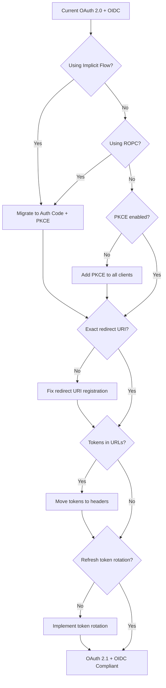

# OIDC Changes in the OAuth 2.0 to 2.1 Transition

**Date:** June 26, 2026

## Overview

OAuth 2.1 is not a ground-up rewrite. It is a consolidation of OAuth 2.0 (RFC 6749) with years of security best practices, errata, and extension RFCs folded into one specification (`draft-ietf-oauth-v2-1-15`). Because OpenID Connect (OIDC) is an authentication layer built on top of OAuth, every change in the underlying authorization framework ripples upward into how identity tokens are requested, delivered, and validated.

This article covers what changed, what was removed, and what it means for OIDC deployments.

## What OAuth 2.1 Removes

### Implicit Grant — Gone

The Implicit flow returned tokens directly in the browser URL fragment (`#access_token=...`). This was convenient for early single-page apps (SPAs) but leaked tokens through browser history, referrer headers, and server logs.

- **OAuth 2.0**: Allowed and widely used for SPAs.
- **OAuth 2.1**: Formally removed. SPAs must now use Authorization Code + PKCE.

**OIDC impact**: The `response_type=token` and hybrid flows that relied on front-channel token delivery are deprecated. OIDC clients must request `response_type=code` and perform a back-channel token exchange.

### Resource Owner Password Credentials (ROPC) — Gone

ROPC let the client collect the user's password directly and exchange it for tokens. This violated the core delegation principle of OAuth.

- **OAuth 2.0**: Defined as a grant type for "legacy" use.
- **OAuth 2.1**: Removed entirely.

**OIDC impact**: Any OIDC flow that used `grant_type=password` to obtain an ID token must be migrated to the Authorization Code flow.

## What OAuth 2.1 Mandates

### PKCE for All Clients

Proof Key for Code Exchange (PKCE, RFC 7636) was originally designed for mobile/public clients that cannot store secrets. OAuth 2.1 makes it mandatory for **every** client, including confidential server-side applications.

```
Authorization Request:
  GET /authorize?
    response_type=code
    &client_id=...
    &redirect_uri=...
    &code_challenge=<SHA256(verifier)>
    &code_challenge_method=S256
    &scope=openid profile email

Token Exchange:
  POST /token
    grant_type=authorization_code
    &code=...
    &code_verifier=<original_random_string>
```

**OIDC impact**: Every OIDC authentication request must include `code_challenge` and `code_challenge_method`. Authorization servers must reject requests that omit them.

### Exact Redirect URI Matching

OAuth 2.0 allowed wildcard or substring matching for redirect URIs on some implementations. OAuth 2.1 requires byte-exact comparison.

- `https://app.example.com/callback` ✅
- `https://app.example.com/callback?extra=param` ❌
- `https://*.example.com/callback` ❌

**OIDC impact**: Register the full, exact redirect URI with your identity provider. No wildcards, no trailing slashes, no extra query parameters.

### No Bearer Tokens in URLs

Tokens must travel in HTTP headers (`Authorization: Bearer <token>`) or POST bodies — never as URL query parameters.

**OIDC impact**: Any OIDC client that passed access tokens or ID tokens via query strings must switch to header-based transport.

### Refresh Token Security

OAuth 2.1 recommends sender-constrained refresh tokens or token rotation (issuing a new refresh token with every use and invalidating the old one).

**OIDC impact**: OIDC clients using long-lived sessions via refresh tokens should implement rotation. If a rotated token is replayed, the authorization server should revoke the entire token family.

## OIDC-Specific Evolution

While OAuth 2.1 tightens the authorization layer, the OIDC ecosystem has its own parallel evolution.

### FAPI 2.0 Security Profile

The Financial-grade API (FAPI) 2.0 profile, finalized in 2025, represents the strictest application of OIDC + OAuth:

| Requirement | OIDC Core 1.0 | FAPI 2.0 |
|:--|:--|:--|
| Auth flow | Multiple options | Authorization Code only |
| PKCE | Optional | Mandatory |
| Token binding | Optional | Mandatory (mTLS or DPoP) |
| Auth requests | Standard | Pushed Authorization Requests (PAR) mandatory |
| ID token delivery | Front or back-channel | Back-channel only |
| ID token encryption | Optional | Required in high-security profiles |

FAPI 2.0 eliminates optionality. If you are building for finance, healthcare, or government, this is the baseline.

### OpenID Federation 1.0

Traditional OIDC requires manual registration between each Relying Party (RP) and Identity Provider (IdP). OpenID Federation replaces this with **trust chains** — sequences of signed JWTs that let entities discover and trust each other without prior direct relationships.

- **Trust Anchors** define policies that propagate through the chain.
- **Metadata Policies** constrain how tokens are requested and validated within the federation.
- The ID token itself (claims like `iss`, `sub`, `aud`) remains unchanged, but validation happens in the context of the resolved trust chain.

### Sender-Constrained Tokens (DPoP and mTLS)

Beyond simple bearer tokens, modern OIDC deployments increasingly use proof-of-possession:

- **DPoP (Demonstrating Proof-of-Possession)**: The client signs each request with an ephemeral key, and the token is bound to that key. Even if intercepted, the token is useless without the private key.
- **mTLS (Mutual TLS)**: The client authenticates with a certificate at the TLS layer, and tokens are bound to that certificate.

## Migration Flow



## Quick Migration Checklist

- [ ] Remove all Implicit flow (`response_type=token`) implementations
- [ ] Remove all ROPC (`grant_type=password`) implementations
- [ ] Add PKCE (`code_challenge` + `code_verifier`) to every Authorization Code flow
- [ ] Audit and enforce exact redirect URI matching
- [ ] Ensure tokens are never sent as URL query parameters
- [ ] Implement refresh token rotation or sender-constrained tokens
- [ ] Update client libraries and SDK versions
- [ ] Test in staging with feature flags before production rollout
- [ ] Review FAPI 2.0 requirements if operating in regulated sectors

## What Stays the Same

Not everything changes. The core OIDC concepts remain intact:

- **ID Tokens** are still JWTs with standard claims (`iss`, `sub`, `aud`, `exp`, `iat`, `nonce`).
- **UserInfo endpoint** still works the same way.
- **Scopes** (`openid`, `profile`, `email`) are unchanged.
- **Discovery** (`.well-known/openid-configuration`) is unchanged.
- **Client Credentials** flow for machine-to-machine auth remains in OAuth 2.1.
- **Device Code** flow for input-limited devices remains in OAuth 2.1.

## References

1. [RFC 6749 — OAuth 2.0](https://datatracker.ietf.org/doc/html/rfc6749)
2. [OAuth 2.1 Draft (draft-ietf-oauth-v2-1)](https://datatracker.ietf.org/doc/html/draft-ietf-oauth-v2-1)
3. [RFC 7636 — PKCE](https://datatracker.ietf.org/doc/html/rfc7636)
4. [OpenID Connect Core 1.0](https://openid.net/specs/openid-connect-core-1_0.html)
5. [FAPI 2.0 Security Profile](https://openid.net/specs/fapi-2_0-security-profile.html)
6. [OpenID Federation 1.0](https://openid.net/specs/openid-federation-1_0.html)
7. [OAuth 2.0 Security BCP](https://datatracker.ietf.org/doc/html/draft-ietf-oauth-security-topics)
8. [DPoP — RFC 9449](https://datatracker.ietf.org/doc/html/rfc9449)
9. [oauth.net — OAuth 2.1](https://oauth.net/2.1/)
