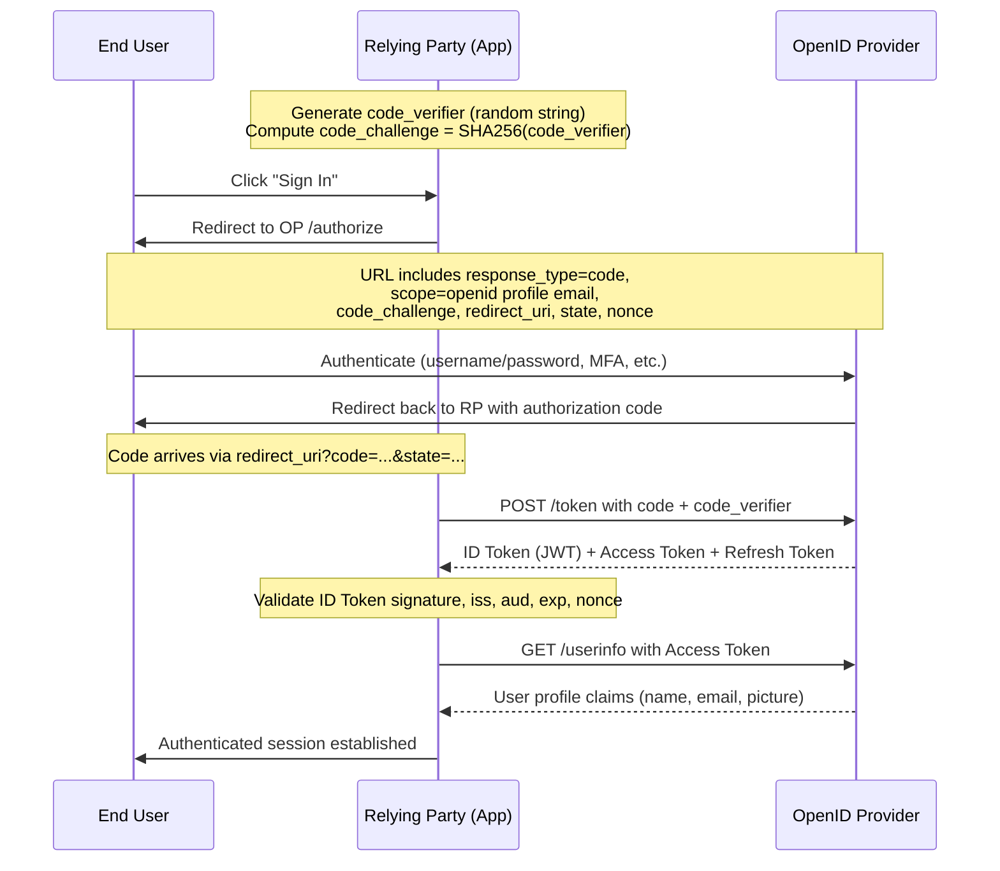

# OpenID Connect (OIDC): Introduction, Walkthrough, and History

**Date:** June 28, 2026

## Overview

OpenID Connect (OIDC) is the identity layer built on top of OAuth 2.0. Where OAuth 2.0 answers the question "what is this application allowed to access?", OIDC answers "who is the person using this application?" It is the protocol behind every "Sign in with Google", "Login with Microsoft", and "Continue with Apple" button on the modern web.

This article traces OIDC from its origins in the early OpenID experiments of 2005, walks through the protocol mechanics step by step, and maps the timeline of how internet authentication arrived at its current form.

## The Problem OIDC Solves

Before federated identity protocols existed, every website managed its own usernames and passwords. This created three compounding problems:

- **Password fatigue**: Users reused the same password across dozens of sites.
- **Security liability**: Every site became a custodian of credentials it was not equipped to protect.
- **Friction**: Creating an account on every new service slowed adoption.

The industry needed a way to let a trusted third party (an Identity Provider) confirm a user's identity to an application, without the application ever seeing the user's password. OIDC is the mature answer to that need.

## Timeline and History

### 2005 — OpenID 1.0: The URL as Identity

Brad Fitzpatrick, creator of LiveJournal, proposed a system where a user's identity was a URL. You owned `http://yourname.example.com`, and any website could verify your identity by checking that URL against an OpenID server.

- Decentralized by design — anyone could run an OpenID server.
- Adopted by early Web 2.0 services (LiveJournal, WordPress, Blogger).
- No standard for exchanging profile information.
- No token-based authorization — purely authentication.

### 2007 — OpenID 2.0: Attributes and Discovery

OpenID 2.0 introduced the Attribute Exchange (AX) extension, allowing identity providers to share profile data (name, email) with relying parties. It also added a discovery mechanism so clients could find the right OpenID endpoint for a given identity URL.

- Improved interoperability between providers.
- Still XML-based and complex to implement.
- Major providers (Google, Yahoo, AOL) added support.

### 2007–2010 — OAuth 1.0 and the Authorization Gap

OAuth 1.0 (2007) and OAuth 1.0a (2009) emerged as a separate protocol for delegated authorization — allowing an application to access a user's resources (photos, contacts) on another service without sharing credentials. OAuth solved authorization but explicitly did not address authentication. This created a gap: developers started using OAuth access tokens as proof of identity, which was never the intended use and led to security vulnerabilities.

### 2012 — OAuth 2.0 (RFC 6749): Simplified Authorization

OAuth 2.0 replaced the signature-based approach of OAuth 1.0 with bearer tokens over TLS. It was simpler, more flexible, and quickly became the dominant authorization framework. But it still had no standard mechanism for authentication. The community recognized the need for an identity layer on top of OAuth 2.0.

### 2010–2013 — The Bridge Era

Several attempts were made to combine OpenID authentication with OAuth authorization:

- **Google's "Step 2" hybrid** grafted OpenID 2.0 authentication onto OAuth 1.0 token flows.
- **OpenID Connect AB/ABC working groups** formed within the OpenID Foundation to design a clean identity layer for OAuth 2.0.
- These bridge approaches were inconsistent across implementations and hard to standardize.

### 2014 — OpenID Connect Core 1.0: The Standard

In February 2014, the OpenID Foundation published the **OpenID Connect Core 1.0** specification. OIDC took everything the community had learned from OpenID 1.0/2.0 and OAuth and distilled it into a single, clean protocol:

- Built directly on OAuth 2.0 (reuses its flows and token types).
- Introduced the **ID Token** — a signed JWT containing identity claims.
- Defined standard scopes (`openid`, `profile`, `email`, `address`, `phone`).
- Published companion specs for Discovery, Dynamic Registration, and Session Management.

By the end of 2015, Google, Microsoft, and other major providers had deprecated OpenID 2.0 and migrated fully to OIDC.

### 2015–2023 — OIDC Becomes Universal

OIDC expanded beyond web login:

- **2015**: Google deprecates OpenID 2.0 in favor of OIDC.
- **2017**: Financial-grade API (FAPI) 1.0 profile published, applying OIDC to banking and finance.
- **2018**: PKCE (RFC 7636) adoption accelerates for mobile and SPA clients.
- **2021**: OAuth 2.1 draft begins consolidating security best practices.
- **2022**: FAPI 2.0 draft tightens requirements with mandatory PKCE, PAR, and sender-constrained tokens.
- **2023**: OpenID Federation 1.0 specification published for cross-organizational trust chains.

### 2024–Present — Modern OIDC

The current era focuses on eliminating optionality and strengthening security:

- **OAuth 2.1** finalizes the removal of Implicit and ROPC flows.
- **DPoP (RFC 9449)** and **mTLS** replace simple bearer tokens with proof-of-possession.
- **Verifiable Credentials** and **OpenID for Verifiable Presentations (OID4VP)** extend OIDC into decentralized identity.
- **Continuous Access Evaluation Protocol (CAEP)** enables real-time session revocation.

## How OIDC Works: A Complete Walkthrough

### Key Actors

| Actor | Role |
|:--|:--|
| **End User** | The person authenticating |
| **Relying Party (RP)** | Your application — needs to know who the user is |
| **OpenID Provider (OP)** | The identity service (Google, Okta, Auth0, Keycloak) |
| **UserInfo Endpoint** | An API at the OP that returns additional profile claims |

### The Authorization Code Flow with PKCE

This is the recommended flow for all clients — web apps, mobile apps, and SPAs.



### Step-by-Step Breakdown

**Step 1 — Discovery.** The RP fetches the OP's configuration from `/.well-known/openid-configuration`. This JSON document contains all the endpoints (authorize, token, userinfo, jwks) and supported features.

**Step 2 — Authorization Request.** The RP redirects the user's browser to the OP's authorization endpoint:

```
GET /authorize?
  response_type=code
  &client_id=my-app
  &redirect_uri=https://app.example.com/callback
  &scope=openid profile email
  &state=random-csrf-token
  &nonce=random-replay-guard
  &code_challenge=SHA256(code_verifier)
  &code_challenge_method=S256
```

- `scope=openid` signals this is an OIDC request (not just OAuth).
- `state` prevents CSRF attacks.
- `nonce` prevents token replay attacks.
- `code_challenge` is the PKCE mechanism.

**Step 3 — Authentication.** The OP authenticates the user. This can be username/password, multi-factor authentication, biometrics, or any method the OP supports. The RP never sees the user's credentials.

**Step 4 — Authorization Code.** After successful authentication, the OP redirects the user back to the RP's `redirect_uri` with an authorization code:

```
HTTP/1.1 302 Found
Location: https://app.example.com/callback?code=abc123&state=random-csrf-token
```

**Step 5 — Token Exchange.** The RP sends the authorization code to the OP's token endpoint, along with the original PKCE verifier:

```
POST /token
Content-Type: application/x-www-form-urlencoded

grant_type=authorization_code
&code=abc123
&redirect_uri=https://app.example.com/callback
&client_id=my-app
&code_verifier=original-random-string
```

**Step 6 — Tokens Received.** The OP responds with three tokens:

```json
{
  "id_token": "eyJhbGciOiJSUzI1NiJ9...",
  "access_token": "ya29.a0AfH6SM...",
  "refresh_token": "1//0gdv...",
  "token_type": "Bearer",
  "expires_in": 3600
}
```

**Step 7 — ID Token Validation.** The RP decodes the ID Token (a JWT) and verifies:

- **Signature** — using the OP's public keys from the `jwks_uri`.
- **Issuer (`iss`)** — matches the expected OP.
- **Audience (`aud`)** — matches the RP's `client_id`.
- **Expiration (`exp`)** — the token is not expired.
- **Nonce (`nonce`)** — matches the value sent in Step 2.

**Step 8 — UserInfo (optional).** For additional claims, the RP calls the UserInfo endpoint with the access token.

## Anatomy of an ID Token

An ID Token is a JWT with three parts: header, payload, and signature.

```json
{
  "iss": "https://accounts.google.com",
  "sub": "110248495921238986420",
  "aud": "my-app.apps.googleusercontent.com",
  "exp": 1719561600,
  "iat": 1719558000,
  "nonce": "random-replay-guard",
  "name": "Jane Doe",
  "email": "jane@example.com",
  "email_verified": true,
  "picture": "https://lh3.googleusercontent.com/a/photo.jpg"
}
```

| Claim | Purpose |
|:--|:--|
| `iss` | Issuer — identifies the OP |
| `sub` | Subject — unique user identifier at the OP |
| `aud` | Audience — the RP this token is intended for |
| `exp` | Expiration — Unix timestamp after which the token is invalid |
| `iat` | Issued At — when the token was created |
| `nonce` | Replay protection — matches the request |
| `name`, `email`, `picture` | Profile claims requested via scopes |

## Standard Scopes

| Scope | Claims Returned |
|:--|:--|
| `openid` | `sub` (required for all OIDC requests) |
| `profile` | `name`, `family_name`, `given_name`, `picture`, `updated_at` |
| `email` | `email`, `email_verified` |
| `address` | `address` (structured object) |
| `phone` | `phone_number`, `phone_number_verified` |

## OIDC vs. OAuth 2.0 vs. SAML

| Feature | OAuth 2.0 | OIDC | SAML 2.0 |
|:--|:--|:--|:--|
| Purpose | Authorization | Authentication + Authorization | Authentication + Authorization |
| Token Format | Opaque or JWT | JWT (ID Token) | XML Assertion |
| Transport | HTTP/JSON | HTTP/JSON | HTTP/XML |
| Primary Use | API access | Web/mobile SSO | Enterprise SSO |
| Complexity | Medium | Medium | High |
| Mobile-friendly | Yes | Yes | No |
| Year Standardized | 2012 | 2014 | 2005 |

## The Specification Family

OIDC is not a single document. It is a family of specifications:

- **OpenID Connect Core 1.0** — the main protocol (flows, ID Token, UserInfo, claims).
- **OpenID Connect Discovery 1.0** — the `.well-known/openid-configuration` mechanism.
- **OpenID Connect Dynamic Client Registration 1.0** — automatic client registration with the OP.
- **OpenID Connect Session Management 1.0** — managing login sessions (logout, session state).
- **OpenID Connect Front-Channel Logout 1.0** — logout via browser redirects.
- **OpenID Connect Back-Channel Logout 1.0** — logout via server-to-server notifications.
- **OpenID Connect RP-Initiated Logout 1.0** — the RP triggers the logout flow.
- **OAuth 2.0 Multiple Response Types** — defines `code id_token`, `code token`, etc.
- **OAuth 2.0 Form Post Response Mode** — returns tokens via HTTP POST instead of URL fragments.

## Where OIDC is Headed

The OIDC ecosystem continues to evolve:

- **OpenID for Verifiable Credentials (OID4VCI/OID4VP)**: Extends OIDC to issue and present verifiable credentials (digital IDs, diplomas, licenses) — bridging centralized identity with decentralized wallets.
- **Shared Signals and Events (SSE/CAEP)**: Real-time event streams between providers and relying parties for session revocation, credential compromise, and risk signals.
- **OpenID Federation 1.0**: Replaces manual RP-OP registration with cryptographic trust chains — critical for government and cross-border identity systems.

## Related Articles

- [Understanding OAuth 2.0](understanding-oauth2.md) — the authorization framework OIDC is built on.
- [OIDC Changes in the OAuth 2.0 to 2.1 Transition](oidc-changes-oauth2-to-oauth21.md) — what changed between OAuth 2.0 and 2.1, and how it affects OIDC.

## References

1. [OpenID Connect Core 1.0](https://openid.net/specs/openid-connect-core-1_0.html)
2. [OpenID Connect Discovery 1.0](https://openid.net/specs/openid-connect-discovery-1_0.html)
3. [RFC 6749 — OAuth 2.0 Authorization Framework](https://datatracker.ietf.org/doc/html/rfc6749)
4. [RFC 7519 — JSON Web Token (JWT)](https://datatracker.ietf.org/doc/html/rfc7519)
5. [RFC 7636 — PKCE](https://datatracker.ietf.org/doc/html/rfc7636)
6. [OpenID Foundation — History](https://openid.net/foundation/)
7. [FAPI 2.0 Security Profile](https://openid.net/specs/fapi-2_0-security-profile.html)
8. [OpenID Federation 1.0](https://openid.net/specs/openid-federation-1_0.html)
9. [RFC 9449 — DPoP](https://datatracker.ietf.org/doc/html/rfc9449)
10. [OAuth 2.1 Draft](https://datatracker.ietf.org/doc/html/draft-ietf-oauth-v2-1)
11. [OpenID for Verifiable Credentials](https://openid.net/sg/openid4vc/)
