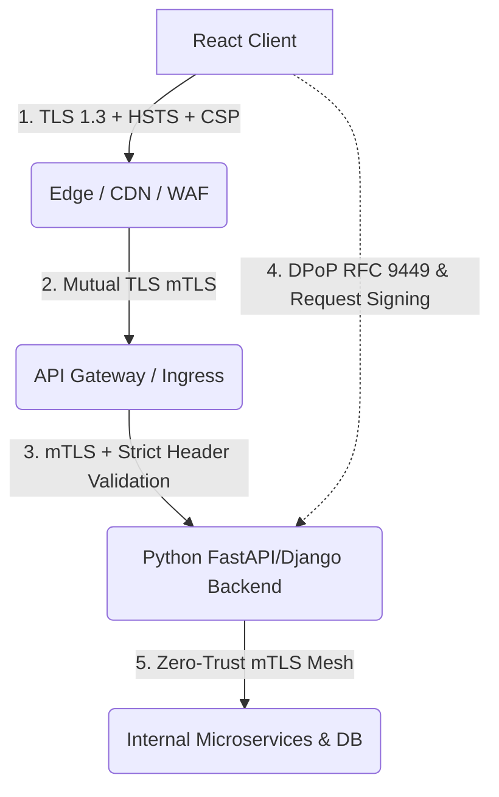
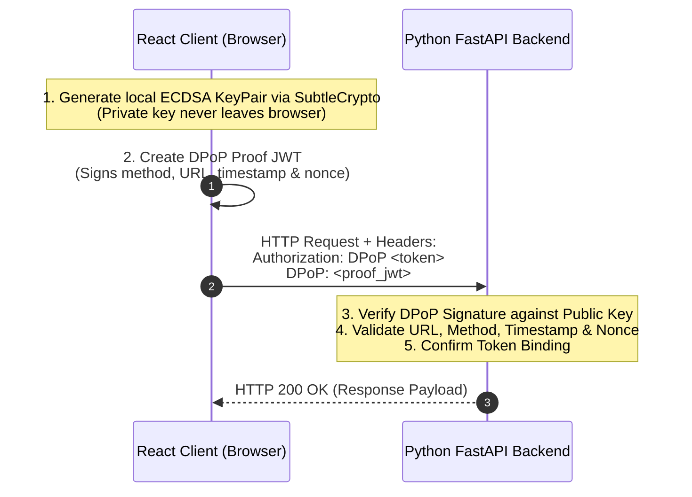

# Mitigating Man-in-the-Middle (MITM) Attacks in Heterogeneous Distributed Applications

**Date:** August 01, 2026

Modern web architectures have largely transitioned from monolithic servers to decoupled, heterogeneous distributed systems. A standard production topology typically features a client-side Single Page Application (SPA) built with **React** (hosted on globally distributed CDNs or static storage buckets like Cloudflare, AWS CloudFront, or Vercel), communicating over REST/GraphQL/gRPC-Web with a backend API cluster powered by **Python** (e.g., FastAPI, Django, Flask, or AsyncIO microservices hosted on Kubernetes, AWS ECS, or GCP Cloud Run).

While this architectural separation brings immense scalability, modularity, and deployment velocity, it dramatically expands the **network threat surface**. In a distributed environment, requests traverse multiple network boundaries, public internet backbones, content delivery networks, reverse proxies, ingress controllers, and internal service meshes. 

Without a rigorous defense-in-depth strategy, these intermediate hops introduce critical vulnerabilities to **Man-in-the-Middle (MITM)** attacks—enabling malicious actors to eavesdrop on sensitive payloads, hijack authentication sessions, tamper with state-altering requests, or spoof upstream services.

```
+------------------+         Public Internet         +--------------------+         Internal Cloud Network        +------------------------+
|   React Client   | =============================> |  CDN / API Gateway | =====================================> | Python Backend Cluster |
| (Untrusted Host) |    (North-South Boundary)      |  (TLS Termination) |         (East-West Boundary)           | (FastAPI / Django Pod) |
+------------------+                                +--------------------+                                        +------------------------+
         |                                                     |                                                              |
    [Threats]                                             [Threats]                                                      [Threats]
  * SSL Stripping                                       * Plaintext VPC                                                * Token Replay
  * Rogue Root CAs                                      * Spoofed Headers                                              * Pod-to-Pod Sniffing
  * XSS / Token Theft                                   * Cache Poisoning                                              * Untrusted Intermediaries
```

---

## The MITM Threat Topology in Heterogeneous Systems

In a heterogeneous React + Python architecture, a MITM attack is not a single isolated vulnerability; rather, it manifests across distinct architectural boundaries.

### 1. North-South Boundary: Client to Ingress / API Gateway
The path between the user's browser (executing React) and the ingress point (CDN or API Gateway) traverses the public internet, public Wi-Fi networks, and telecom routing infrastructure.

* **SSL Stripping & Downgrade Attacks:** Attackers intercept initial unencrypted HTTP requests before an HTTPS redirect completes, proxying the secure connection on their end while serving unencrypted HTTP to the victim.
* **Rogue / Injected Certificate Authorities (CAs):** In enterprise environments, public Wi-Fi hotspots, or malware-compromised devices, a custom Root CA is installed on the client machine. The attacker issues on-the-fly SSL certificates for your API domain (`api.example.com`), transparently decrypting, inspecting, and re-encrypting all traffic.
* **DNS Spoofing & BGP Hijacking:** Poisoning DNS responses or manipulating BGP routes directs API traffic to an attacker-controlled reverse proxy acting as an intermediary.

### 2. The Edge-to-Origin Transit Gap (The "TLS Termination" Trap)
A pervasive anti-pattern in distributed cloud infrastructure is **terminating TLS at the edge load balancer or CDN** and transmitting traffic over plaintext HTTP across the internal Virtual Private Cloud (VPC), container overlay networks, or VPC peering connections to the Python backend.

If an attacker achieves lateral movement within the cloud environment (via a compromised container, SSRF vulnerability, or shared network namespace in multi-tenant environments), they can sniff unencrypted internal traffic (`tcpdump` / ARP spoofing) or forge internal HTTP requests.

### 3. Header Spoofing and Proxy Deception
When reverse proxies and CDNs terminate SSL and proxy requests to Python ASGI/WSGI applications (e.g., Uvicorn, Gunicorn), they append forwarding headers (`X-Forwarded-For`, `X-Forwarded-Proto`, `X-Forwarded-Host`). If the Python application blindly trusts these headers without validating the upstream proxy IP, attackers can spoof client IP addresses, bypass rate limiters, or trigger insecure redirect loops.

### 4. Client-Side Token Interception and Replay
Unlike server-rendered monoliths where session identifiers reside inside protected kernel memory or opaque cookies, SPAs often handle OAuth2 Bearer Tokens (JWTs) in JavaScript. If an attacker intercepts a standard Bearer Token via a proxy or XSS vulnerability, the token can be replayed from anywhere in the world because it is not cryptographic bound to the sender.

---

## Defense-in-Depth Engineering Strategy

Securing a heterogeneous distributed application against MITM requires five interlocking layers of defense:



---

## Layer 1: North-South Transport Hardening

### 1. HTTP Strict Transport Security (HSTS) with Preloading
Ensure browsers *never* issue an unencrypted HTTP request, eliminating SSL-stripping windows.

Configure the reverse proxy (or CDN) and the Python backend to inject the strict HSTS header:

```nginx
# Nginx Edge Configuration
add_header Strict-Transport-Security "max-age=63072000; includeSubDomains; preload" always;
add_header X-Content-Type-Options "nosniff" always;
add_header X-Frame-Options "DENY" always;
```

> [!IMPORTANT]
> Submit your domain to the official [HSTS Preload List](https://hstspreload.org/). Once preloaded, modern browsers hardcode HTTPS for your domain before making the very first network request.

### 2. DNS Security & CAA Records
To prevent unauthorized or rogue CAs from issuing valid certificates for your domains during a DNS-level MITM attempt:
* **Deploy DNSSEC** on your DNS registrar.
* **Publish Certificate Authority Authorization (CAA) Records** restricting certificate issuance exclusively to your designated providers (e.g., Let's Encrypt, DigiCert):

```dns
example.com. IN CAA 0 issue "letsencrypt.org"
example.com. IN CAA 0 iodef "mailto:security@example.com"
```

### 3. Content Security Policy (CSP) & Subresource Integrity (SRI)
If an attacker attempts to inject malicious proxy scripts into the React frontend bundle hosted on a CDN:
* Use **SRI (Subresource Integrity)** hashes on all script tags in `index.html`.
* Enforce a restrictive CSP header ensuring the React application can only connect to authorized backend API origins:

```http
Content-Security-Policy: default-src 'self'; script-src 'self' https://cdn.example.com; connect-src 'self' https://api.example.com; object-src 'none'; base-uri 'self';
```

---

## Layer 2: Heterogeneous Identity & Token Security

In a distributed React + Python setup, **Bearer tokens are vulnerable to replay** if intercepted by a rogue intermediary. We neutralize this vector through two key architectural patterns:

### Strategy A: The BFF (Backend-for-Frontend) Token-Mediating Gateway
Instead of allowing the React SPA to directly handle raw OAuth2 access/refresh tokens:
1. Deploy a lightweight reverse proxy / BFF layer (or use API Gateway session management).
2. Store tokens server-side in encrypted session storage (e.g., Redis).
3. Issue an encrypted `HttpOnly`, `Secure`, `SameSite=Strict` cookie to the React browser.

```
React App (Browser)  --- [HttpOnly + Secure Cookie] --->  BFF Gateway  --- [Bearer Token / mTLS] --->  Python API
```

Because `HttpOnly` cookies cannot be accessed by client JavaScript, XSS-driven token exfiltration is prevented, and the `Secure` attribute guarantees transmission only over verified TLS.

### Strategy B: Sender-Constrained Tokens via DPoP (RFC 9449)
When direct React-to-Python API communication is required without a cookie proxy, standard Bearer JWTs should be replaced with **DPoP (Demonstrating Proof-of-Possession at the Application Layer)**.

With DPoP:
1. The React client generates a local, non-extractable asymmetric keypair (using the browser's `SubtleCrypto` API).
2. For each API request, React signs a miniature, ephemeral JWT proof containing the HTTP method, request URI, timestamp, and a unique hash (`ath`) of the access token.
3. The Python backend validates both the signature of the DPoP proof and its binding to the access token. Even if an intermediary intercepts the network traffic, the access token is mathematically unusable without the client's private key.



---

## Layer 3: Application-Layer Request Signing & Tamper-Proofing

When critical state mutations (financial transfers, administrative role updates, cryptographic approvals) are transmitted, transport encryption alone does not guarantee that intermediate proxies (such as corporate inspection appliances) have not modified the payload body in transit.

Implementing **HMAC-SHA256 Request Signing** ensures end-to-end payload integrity across all network hops.

### 1. React Client Implementation (TypeScript)

The React client constructs a canonical representation of the request (method, path, timestamp, nonce, and raw JSON payload) and computes an HMAC signature using Web Crypto:

```typescript
// src/services/secureClient.ts
export interface SecureRequestOptions {
  method: 'GET' | 'POST' | 'PUT' | 'DELETE';
  url: string;
  body?: Record<string, unknown>;
  clientSecret: string;
}

export async function createSignedHeaders(options: SecureRequestOptions): Promise<HeadersInit> {
  const timestamp = Math.floor(Date.now() / 1000).toString();
  const nonce = crypto.randomUUID();
  const rawBody = options.body ? JSON.stringify(options.body) : '';
  const parsedUrl = new URL(options.url, window.location.origin);
  const path = parsedUrl.pathname + parsedUrl.search;

  // Canonical payload format: METHOD\nPATH\nTIMESTAMP\nNONCE\nBODY
  const canonicalString = `${options.method.toUpperCase()}\n${path}\n${timestamp}\n${nonce}\n${rawBody}`;

  const encoder = new TextEncoder();
  const keyData = encoder.encode(options.clientSecret);
  const cryptoKey = await window.crypto.subtle.importKey(
    'raw',
    keyData,
    { name: 'HMAC', hash: 'SHA-256' },
    false,
    ['sign']
  );

  const signatureBuffer = await window.crypto.subtle.sign(
    'HMAC',
    cryptoKey,
    encoder.encode(canonicalString)
  );

  const signatureHex = Array.from(new Uint8Array(signatureBuffer))
    .map(b => b.toString(16).padStart(2, '0'))
    .join('');

  return {
    'Content-Type': 'application/json',
    'X-Signature-Timestamp': timestamp,
    'X-Signature-Nonce': nonce,
    'X-Signature': signatureHex,
  };
}
```

### 2. Python Backend Implementation (FastAPI Middleware)

The Python FastAPI backend intercepts the incoming raw request stream, checks timestamp drift (preventing replay attacks), enforces nonce uniqueness in Redis, and recalculates the HMAC signature to verify data integrity:

```python
# app/middleware/signature_verification.py
import hmac
import hashlib
import time
from fastapi import Request, HTTPException, status
from starlette.middleware.base import BaseHTTPMiddleware
import redis.asyncio as aioredis

ALLOWED_CLOCK_SKEW_SECONDS = 300  # 5 minutes

class RequestSignatureMiddleware(BaseHTTPMiddleware):
    def __init__(self, app, secret_key: str, redis_client: aioredis.Redis):
        super().__init__(app)
        self.secret_key = secret_key.encode('utf-8')
        self.redis = redis_client

    async def dispatch(self, request: Request, call_next):
        # Exclude public health-checks and docs
        if request.url.path in ["/healthz", "/docs", "/openapi.json"]:
            return await call_next(request)

        timestamp_str = request.headers.get("X-Signature-Timestamp")
        nonce = request.headers.get("X-Signature-Nonce")
        client_sig = request.headers.get("X-Signature")

        if not all([timestamp_str, nonce, client_sig]):
            raise HTTPException(
                status_code=status.HTTP_401_UNAUTHORIZED,
                detail="Missing cryptographic integrity headers"
            )

        # 1. Anti-Replay: Verify Timestamp freshness
        try:
            req_timestamp = int(timestamp_str)
        except ValueError:
            raise HTTPException(status_code=status.HTTP_400_BAD_REQUEST, detail="Invalid timestamp")

        current_time = int(time.time())
        if abs(current_time - req_timestamp) > ALLOWED_CLOCK_SKEW_SECONDS:
            raise HTTPException(
                status_code=status.HTTP_401_UNAUTHORIZED,
                detail="Request timestamp outside acceptable window (potential replay)"
            )

        # 2. Anti-Replay: Enforce single-use Nonce via Redis
        nonce_key = f"nonce:{nonce}"
        is_new_nonce = await self.redis.set(
            nonce_key, "1", ex=ALLOWED_CLOCK_SKEW_SECONDS * 2, nx=True
        )
        if not is_new_nonce:
            raise HTTPException(
                status_code=status.HTTP_409_CONFLICT,
                detail="Nonce has already been used"
            )

        # 3. Read Body & Reconstruct Canonical String
        body_bytes = await request.body()
        body_str = body_bytes.decode('utf-8') if body_bytes else ""
        path_with_query = request.url.path
        if request.url.query:
            path_with_query += f"?{request.url.query}"

        canonical_string = f"{request.method.upper()}\n{path_with_query}\n{timestamp_str}\n{nonce}\n{body_str}"

        # 4. Compute and Constant-Time Compare HMAC
        expected_sig = hmac.new(
            self.secret_key,
            canonical_string.encode('utf-8'),
            hashlib.sha256
        ).hexdigest()

        if not hmac.compare_digest(expected_sig, client_sig):
            raise HTTPException(
                status_code=status.HTTP_403_FORBIDDEN,
                detail="Payload signature verification failed (data modified in flight)"
            )

        # Proceed to downstream route handlers
        response = await call_next(request)
        return response
```

---

## Layer 4: East-West Zero Trust & Mutual TLS (mTLS)

Within the internal network—between the API Gateway/Ingress and the Python microservices—never rely on network perimeter trust. 

### 1. Ingress to Python Backend via mTLS
Mutual TLS ensures that the API Gateway authenticates the Python service's certificate, and the Python service authenticates the API Gateway's certificate. Even if an attacker gains root access to a neighboring pod in the Kubernetes cluster, they cannot inspect or inject traffic into the communication channel.

```nginx
# API Gateway Upstream Configuration (Nginx / Envoy)
upstream python_cluster {
    server backend-service.internal:8443;
}

server {
    listen 443 ssl;
    server_name api.example.com;

    location / {
        proxy_pass https://python_cluster;
        proxy_ssl_certificate        /etc/ssl/certs/gateway-client.crt;
        proxy_ssl_certificate_key    /etc/ssl/certs/gateway-client.key;
        proxy_ssl_trusted_certificate /etc/ssl/certs/internal-ca.crt;
        proxy_ssl_verify             on;
        proxy_ssl_verify_depth       2;
        
        # Forward validated headers
        proxy_set_header X-Forwarded-For $proxy_add_x_forwarded_for;
        proxy_set_header X-Forwarded-Proto $scheme;
    }
}
```

### 2. Python Proxy Header Hardening (Trusted Proxies)
When running behind reverse proxies, Python applications must **never** blindly trust headers like `X-Forwarded-For` or `X-Forwarded-Proto` unless the request originates from a pre-whitelisted internal IP address.

In **FastAPI / Starlette / Uvicorn**:

```python
# main.py
from fastapi import FastAPI
from uvicorn.middleware.proxy_headers import ProxyHeadersMiddleware

app = FastAPI()

# Only trust forwarded headers from designated Gateway CIDR blocks
app.add_middleware(
    ProxyHeadersMiddleware,
    trusted_hosts=["10.0.0.0/16", "172.16.0.10"]
)
```

In **Django**:

```python
# settings.py
SECURE_PROXY_SSL_HEADER = ('HTTP_X_FORWARDED_PROTO', 'https')
USE_X_FORWARDED_HOST = True
# Configure django-trusted-proxies or use reverse-proxy firewalls
```

---

## Layer 5: Mobile & Desktop Client Hardening (SSL/TLS Pinning)

If your React frontend is packaged as a hybrid mobile application (React Native / Capacitor / Ionic) or desktop application (Electron), standard browser CA validation can be bypassed by users installing local debugging certificates (e.g., Charles Proxy, Burp Suite, Fiddler).

### Public Key (SPKI) Pinning
Rather than pinning entire leaf certificates (which expire and break apps), pin the **SHA-256 hash of the Subject Public Key Information (SPKI)**.

```typescript
// React Native / Native Fetch Plugin Example
import { initializeSslPinning } from 'react-native-ssl-public-key-pinning';

await initializeSslPinning({
  'api.example.com': {
    includeSubdomains: true,
    publicKeyHashes: [
      'AAAAAAAAAAAAAAAAAAAAAAAAAAAAAAAAAAAAAAAAAAA=', // Primary Certificate Public Key Pin
      'BBBBBBBBBBBBBBBBBBBBBBBBBBBBBBBBBBBBBBBBBBB=', // Backup Disaster-Recovery Pin
    ],
  },
});
```

> [!CAUTION]
> Always maintain at least one **backup pin** belonging to a cold backup intermediate or root key. If your primary TLS key is rotated without a backup pin in the client binary, existing installed apps will be permanently locked out until updated via the App Store.

---

## Defense Matrix Summary

| Layer | Architecture Tier | Attack Vector Mitigated | Concrete Implementation |
| :--- | :--- | :--- | :--- |
| **Transport** | North-South (Client $\to$ Edge) | SSL Stripping, Downgrades | TLS 1.3, HSTS Preload, CAA, DNSSEC |
| **Content** | CDN $\to$ Browser | Script Injection / CDN Tampering | Strict CSP (`connect-src`), SRI Hashes |
| **Session** | React $\leftrightarrow$ API Gateway | Token Exfiltration, CSRF | BFF Pattern, `HttpOnly` + `Secure` + `SameSite=Strict` Cookies |
| **Identity** | React $\leftrightarrow$ Python Backend | Bearer Token Interception & Replay | OAuth 2.0 DPoP (RFC 9449), Sender-Constrained Proofs |
| **Integrity** | Application Layer (End-to-End) | Payload Modification, Replay Attacks | HMAC-SHA256 Request Signing, Timestamps, Redis Nonce Check |
| **East-West** | Gateway $\leftrightarrow$ Python Backend | Internal Sniffing, Lateral Movement | mTLS with Internal CA, Strict `trusted_hosts` Proxy Validation |
| **Native Client** | React Native / Electron | Rogue Local Root CAs, Intercept Proxies | SPKI Public Key Pinning with Disaster-Recovery Pins |

---

## Conclusion

In a modern distributed application where a React frontend sits heterogeneously across networks from a Python backend, **HTTPS alone is not a panacea**. Transport Layer Security secures only individual point-to-point connections; it does not protect against compromised intermediaries, misconfigured internal networks, or intercepted client tokens.

By combining **strict transport hygiene (HSTS/CAA)**, **sender-constrained identity (BFF / DPoP)**, **end-to-end cryptographic payload signing**, and **internal zero-trust mTLS**, engineering teams can build resilient distributed architectures capable of withstanding sophisticated Man-in-the-Middle attacks across all network boundaries.
