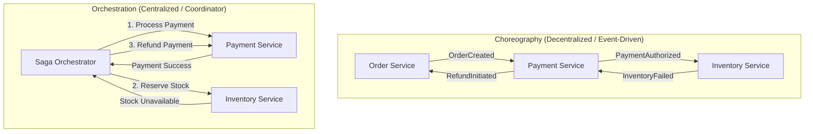
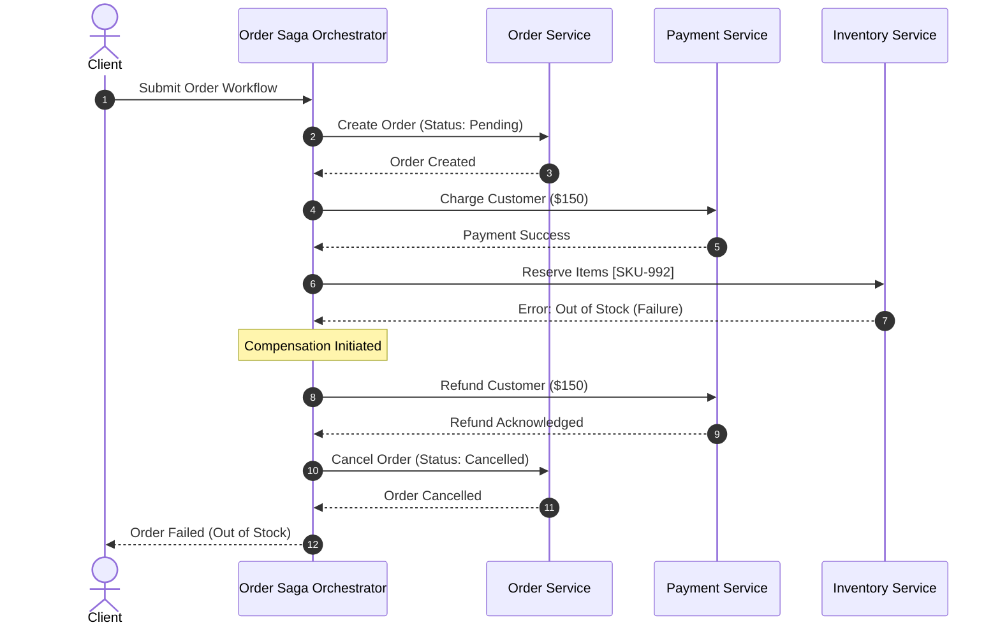

# The Saga Pattern: Managing Distributed Transactions and Eventual Consistency in Microservices

**Date:** August 02, 2026

In a monolithic architecture, managing data integrity across multiple operations is straightforward. Relational databases provide robust **ACID** (Atomicity, Consistency, Isolation, Durability) guarantees using local database transactions. If an operation fails midway through checking out a shopping cart—such as a credit card decline after decrementing stock—the database issues a `ROLLBACK`, reverting all modified tables to their initial pristine state within milliseconds.

However, as systems scale and adopt microservices with a **Database-per-Service** pattern, single-database ACID guarantees vanish. An end-to-end business workflow—such as creating an order, charging a customer, reserving warehouse inventory, and dispatching a delivery carrier—now spans multiple distinct databases across disparate network boundaries.

```
Monolithic (ACID):
[ Client ] ---> [ Monolith ] ---> [ Single Relational DB ] (Local BEGIN / COMMIT / ROLLBACK)

Microservices (Distributed):
[ Client ] ---> [ Order Service ]      ---> [ Order DB ]
                     | (Network)
                [ Payment Service ]    ---> [ Payment DB ]
                     | (Network)
                [ Inventory Service ]  ---> [ Inventory DB ]
                     | (Network)
                [ Shipping Service ]   ---> [ Shipping DB ]
```

When a step fails in this distributed chain (e.g., payment succeeds, but inventory is out of stock), you cannot execute a database-level `ROLLBACK` across independent services.

To solve this challenge without sacrificing service autonomy and performance, distributed architectures rely on the **Saga Pattern**.

---

## Why Traditional Two-Phase Commit (2PC) Fails at Scale

Before diving into Sagas, it is critical to understand why the classical distributed transaction standard—**Two-Phase Commit (2PC / XA Transactions)**—is widely avoided in modern cloud-native systems:

1. **Synchronous Blocking & Latency Amplification:** In 2PC, a central coordinator asks all participating databases to `PREPARE` (phase 1) and hold database locks on the affected rows until all participants agree, followed by a `COMMIT` (phase 2). If any node is slow or network latency spikes, locks are held across all services, causing massive connection pool exhaustion and cascading latency.
2. **Single Point of Failure (SPOF):** If the transaction coordinator crashes during phase 2 after participants have prepared and locked rows, participant databases are left in an uncertain state, indefinitely holding locks and blocking other transactions.
3. **Incompatible with Modern Datastores:** Many modern NoSQL datastores (Cassandra, DynamoDB, MongoDB, Redis) and message brokers (Kafka, RabbitMQ) do not support XA/2PC protocols.
4. **CAP Theorem Realities:** 2PC chooses strong Consistency (CP) over Availability (AP). In large-scale distributed systems where network partitions and transient failures are inevitable, holding distributed locks severely degrades system availability.

---

## What is the Saga Pattern?

Originally proposed in 1987 by **Hector Garcia-Molina and Kenneth Salem** for long-lived transactions in database engines, the Saga pattern was later adapted for distributed microservice architectures.

A **Saga** is a sequence of local transactions ($T_1, T_2, \dots, T_n$) where each local transaction updates data within a single service and publishes a message or event. If all local transactions complete successfully, the saga finishes. 

If any local transaction ($T_k$) fails due to business rule violations (e.g., insufficient funds, out-of-stock items) or fatal validation errors, the saga executes a series of **compensating transactions** ($C_{k-1}, \dots, C_1$) in reverse order to undo the changes made by the preceding transactions.

```
Success Path:
[ T1: Create Order ] ---> [ T2: Charge Payment ] ---> [ T3: Reserve Inventory ] ---> [ T4: Dispatch Delivery ]

Failure at T3 (Inventory Out of Stock):
[ T1: Create Order ] ---> [ T2: Charge Payment ] ---> [ T3: Reserve Inventory (FAILS) ]
                                                               |
[ C1: Cancel Order ] <--- [ C2: Refund Payment ] <-------------+
```

### Key Concepts & Transaction Classification

In a Saga workflow, individual steps are categorized into three distinct transaction types:

1. **Compensable Transactions ($T_c$):** Transactions that can potentially be rolled back or undone using a compensating transaction. (e.g., reserving inventory can be compensated by un-reserving inventory).
2. **Pivot Transaction ($T_p$):** The critical "point of no return" in the saga. Once the pivot transaction succeeds, the saga will not abort; subsequent steps must succeed (using retries). If the pivot transaction fails, all previous compensable transactions are rolled back.
3. **Retryable / Repeatable Transactions ($T_r$):** Transactions that execute after the pivot transaction and are guaranteed to succeed eventually via automatic retries and idempotent execution (e.g., sending an order confirmation email, initiating a delivery request).

---

## Compensating Transactions: Semantic Undo vs. Technical Rollback

A fundamental difference between database rollbacks and saga compensation is that **compensating transactions are semantic rollbacks**, not technical rollbacks.

* **Database Rollback:** Reverts rows to their previous disk state as if the transaction never happened.
* **Compensating Transaction:** Executes a *new forward-moving business operation* that counteracts the business effect of an earlier operation.

| Original Transaction ($T_i$) | Compensating Transaction ($C_i$) | Semantic Reality |
| :--- | :--- | :--- |
| Debit \$100 from Bank Account | Credit \$100 to Bank Account | Generates a new statement entry; does not erase the debit record |
| Reserve 2 seats on Flight 101 | Release 2 reserved seats | Seats return to available pool; audit trail records reservation and cancellation |
| Create `PENDING` Order Record | Update Order status to `CANCELLED` | Order record persists with updated state for analytics and audit |

Because compensating transactions are new transactions, they must be designed with two non-negotiable properties:
1. **Idempotence:** A compensating transaction may be retried multiple times due to network glitches; processing it more than once must yield the exact same end state.
2. **Guaranteed Execution:** Compensating transactions cannot fail due to business validation rules. They can only fail due to transient technical errors (e.g., network timeout), which must be handled with persistent retry loops.

---

## Saga Implementation Models: Choreography vs. Orchestration

There are two primary architectural patterns to coordinate a Saga: **Choreography (Event-Driven)** and **Orchestration (Command-Driven)**.



---

### 1. Choreography-Based Saga (Event-Driven)

In a choreographed saga, there is no central controller. Participating services listen to domain events emitted by other services via a distributed message broker (e.g., Apache Kafka, RabbitMQ, AWS SQS/SNS) and autonomously execute their local transactions.

#### Step-by-Step Flow:

```
[Client] 
   | (1. POST /orders)
   v
[Order Service] ------ (Publishes: OrderCreatedEvent) ------> [Message Broker]
                                                                     |
       +-------------------------------------------------------------+
       | (Subscribes)
       v
[Payment Service] ---> Executes local debit
       |
       +------------ (Publishes: PaymentProcessedEvent) ----> [Message Broker]
                                                                     |
       +-------------------------------------------------------------+
       | (Subscribes)
       v
[Inventory Service] -> Executes local stock reservation
       |
       +------------ (Publishes: InventoryReservedEvent) ---> [Message Broker]
                                                                     |
       +-------------------------------------------------------------+
       | (Subscribes)
       v
[Shipping Service] --> Schedules carrier dispatch
```

#### Compensation Flow on Failure:
If `Inventory Service` detects that an item is out of stock:
1. `Inventory Service` emits `InventoryFailedEvent`.
2. `Payment Service` consumes `InventoryFailedEvent` and executes `RefundPayment` ($C_2$).
3. `Order Service` consumes `PaymentRefundedEvent` and sets the order status to `REJECTED` ($C_1$).

#### Advantages:
* **Loose Coupling:** Services only need to know about domain events, not about the implementation or APIs of downstream services.
* **Simplicity for Small Workflows:** Straightforward to set up for 2 to 3 microservices without deploying dedicated orchestration engines.

#### Disadvantages & Risks:
* **Cyclic Dependencies & Spaghetti Workflows:** As business logic grows to 6+ services, tracing event dependency graphs becomes difficult.
* **Observability Blind Spots:** Understanding the global state of a transaction requires complex distributed tracing (e.g., OpenTelemetry, Jaeger) and correlation ID tracking across dozens of event topics.
* **Deadlock & Race Conditions:** Two services reacting to each other's events simultaneously can create unresolvable race conditions.

---

### 2. Orchestration-Based Saga (Command-Driven)

In an orchestrated saga, a dedicated **Saga Orchestrator** (State Machine) explicitly coordinates the workflow. The orchestrator sends direct commands to participating services, waits for command responses, and determines the next step or rollback sequence based on the returned status.

Popular tools used for orchestrators include **Temporal.io**, **AWS Step Functions**, **Camunda/Zeebe**, **Cadence**, or custom state machines backed by PostgreSQL/Redis.



#### Step-by-Step Flow:
1. `Saga Orchestrator` sends `ProcessPaymentCommand` to `Payment Service`.
2. `Payment Service` replies with `PaymentSuccessReply`.
3. `Saga Orchestrator` updates its internal state table and sends `ReserveInventoryCommand` to `Inventory Service`.
4. If `Inventory Service` replies with `OutOfStockReply`, the Orchestrator halts forward progress and executes:
   - `RefundPaymentCommand` $\rightarrow$ `Payment Service`
   - `CancelOrderCommand` $\rightarrow$ `Order Service`

#### Advantages:
* **Centralized Visibility:** The orchestrator maintains the single source of truth for the transaction's state machine, making monitoring, debugging, and auditing trivial.
* **No Cyclic Dependencies:** Services simply expose command-handling endpoints or message queues; they do not need to know about the overarching saga.
* **Separation of Concerns:** Business workflow logic resides in the orchestrator; domain services focus exclusively on core domain boundaries.

#### Disadvantages:
* **Additional Infrastructure:** Requires managing stateful orchestration infrastructure (e.g., Temporal clusters or Step Functions state definitions).
* **Risk of Over-Centralization:** If developers put domain logic into the orchestrator rather than keeping it purely as a state coordinator, the orchestrator can degenerate into an anti-pattern "smart coordinator, dumb services" monolith.

---

### Comparison Matrix

| Feature / Criterion | Choreography (Event-Driven) | Orchestration (Command-Driven) |
| :--- | :--- | :--- |
| **Coordination** | Decentralized, event-driven | Centralized state machine / coordinator |
| **Coupling** | Loose (Event contracts) | Low-to-Medium (Commands directed to services) |
| **Complexity** | Simple for 2–3 services; scales poorly | Requires state machine setup; scales well |
| **Monitoring & Debugging** | Difficult; requires distributed trace stitching | Easy; inspect orchestrator state log |
| **Rollback Complexity** | High; all services must subscribe to failure events | Low; orchestrator handles reverse sequence |
| **Best Used For** | Simple workflows, high-throughput micro-steps | Complex, long-running, multi-step business transactions |

---

## The Isolation Problem: ACID Without the 'I'

The most critical architectural challenge when implementing the Saga pattern is the **lack of Isolation (ACD, not ACID)**.

Because each local transaction commits immediately to its respective database, **intermediate states are visible to concurrent transactions** before the saga has finished or before compensations can be triggered.

### Concurrency Anomalies in Sagas

1. **Dirty Reads:** A concurrent transaction reads uncommitted business data that is later compensated and discarded.
   * *Example:* Customer A's saga reserves the last available airline seat ($T_1$). Customer B views seat availability and sees the plane as full. Customer A's payment fails at $T_2$, triggering compensation $C_1$ which frees the seat. Customer B missed purchasing the seat due to a dirty read.
2. **Lost Updates:** Saga 1 updates a record without locking it. Saga 2 updates the same record and commits. Saga 1 subsequently aborts and runs compensation, unintentionally overwriting Saga 2's valid update.
3. **Non-Repeatable (Fuzzy) Reads:** A service reads a row at step 1, but another concurrent saga alters the row before step 3, leading to inconsistent calculations.

---

## Countermeasures Against Isolation Anomalies

To counteract the lack of isolation, distributed system engineers employ specific architectural design patterns:

```
+---------------------------------------------------------------------------------------+
|                                 Saga Isolation Countermeasures                         |
+---------------------------------------------------------------------------------------+
| 1. Semantic Lock        | Mark entities as PENDING / RESERVED before final commit     |
| 2. Commutative Updates  | Design operations where execution order does not alter sum  |
| 3. Pessimistic Ordering | Order saga steps to place high-risk operations first        |
| 4. Reread / Version Lock| Use optimistic concurrency control (OCC) before writes      |
| 5. By-Value Routing     | Route high-value transactions via 2PC, low-value via Saga   |
+---------------------------------------------------------------------------------------+
```

### 1. Semantic Lock (Pending States)
Instead of hard-debiting or hard-allocating resources, set the record state to a transitional status (e.g., `ORDER_PENDING_PAYMENT`, `SEAT_HELD_10_MIN`). Other operations inspecting the record treat pending states appropriately (e.g., blocking duplicate attempts or displaying a "hold" banner).

### 2. Commutative Updates
Design compensable operations to be **commutative** ($A \cdot B = B \cdot A$). If operations can be executed in any order, lost updates and race conditions cannot corrupt the balance.
* *Example:* Rather than `SET balance = 100`, use atomic increments: `UPDATE accounts SET balance = balance - 50 WHERE id = 123`.

### 3. Pessimistic Reordering
Reorder the steps of your saga to minimize financial or operational risk. Place operations that cannot be easily compensated or have high external impact (e.g., sending physical mail, manufacturing a customized item, paying a vendor) **after the pivot transaction**.

### 4. Optimistic Version Locking (Reread Value)
Before applying an update in a subsequent saga step, verify that the record's version token has not mutated since the initial read:
```sql
UPDATE inventory 
SET available_quantity = available_quantity - 1, version = version + 1
WHERE product_id = 'SKU-100' AND version = 4;
```
If zero rows are updated, a concurrent modification occurred, allowing the service to fail gracefully and initiate saga compensation.

---

## Production Patterns: Ensuring Atomic Reliability

A distributed saga is only as reliable as the messaging and database interaction within each service. Two architectural patterns are mandatory to prevent split-brain and message loss:

### 1. The Transactional Outbox Pattern

In microservices, a common bug is updating a local database and then publishing a message to Kafka. If the database commit succeeds but the network crashes before publishing the message, the saga stalls permanently.

The **Transactional Outbox Pattern** ensures that database updates and message publishing occur within the same local ACID transaction:

```sql
BEGIN TRANSACTION;

-- 1. Perform core business update
UPDATE orders SET status = 'PROCESSING' WHERE id = 'ORD-501';

-- 2. Insert event record into outbox table in the SAME database
INSERT INTO outbox_events (id, aggregate_type, aggregate_id, event_type, payload, created_at)
VALUES ('evt-889', 'Order', 'ORD-501', 'OrderPaid', '{"amount": 150}', NOW());

COMMIT;
```

A separate background process (e.g., **Debezium** using Change Data Capture / CDC, or a polling relay) reads the `outbox_events` table and reliably delivers the events to Apache Kafka with **at-least-once delivery guarantees**.

```mermaid
flowchart LR
    A[Service App] -->|1. Local ACID Transaction| B[(PostgreSQL DB)]
    subgraph B [(PostgreSQL DB)]
        T1[Business Table]
        T2[Outbox Table]
    end
    T2 -->|2. CDC / Debezium| C[Kafka Broker]
    C -->|3. Consume Event| D[Downstream Service]
```

### 2. Idempotent Consumer Pattern

Because message brokers guarantee *at-least-once* delivery, participating services will occasionally receive duplicate messages due to network retries.

Every participating service must maintain a processed message ledger:

```python
def handle_payment_command(command: ProcessPaymentCommand, db_session):
    # Check if message was already processed
    if db_session.query(ProcessedMessage).filter_by(message_id=command.message_id).first():
        logger.info(f"Duplicate message {command.message_id} ignored.")
        return
    
    # Execute business logic
    account = db_session.query(Account).filter_by(id=command.account_id).with_for_update().first()
    account.balance -= command.amount
    
    # Record message execution inside the same transaction
    db_session.add(ProcessedMessage(message_id=command.message_id, processed_at=datetime.utcnow()))
    db_session.commit()
```

---

## When to Use and When NOT to Use the Saga Pattern

```
                                  +-----------------------------+
                                  | Does transaction span       |
                                  | multiple datastores/APIs?   |
                                  +-----------------------------+
                                                 |
                                         +-------+-------+
                                      No |               | Yes
                                         v               v
                         +-----------------------+  +---------------------------+
                         | Use Local ACID DB     |  | Can business tolerate     |
                         | Transaction           |  | eventual consistency?     |
                         +-----------------------+  +---------------------------+
                                                                 |
                                                         +-------+-------+
                                                      No |               | Yes
                                                         v               v
                                         +-----------------------+  +---------------------------+
                                         | Reconsider Monolith / |  | Is workflow complex with  |
                                         | Single Shared DB      |  | 4+ steps & strict audits? |
                                         +-----------------------+  +---------------------------+
                                                                                 |
                                                                         +-------+-------+
                                                                      No |               | Yes
                                                                         v               v
                                                         +-----------------------+  +---------------------------+
                                                         | Choreography-Based    |  | Orchestration-Based       |
                                                         | Saga (Kafka/RabbitMQ) |  | Saga (Temporal/Step Fn)   |
                                                         +-----------------------+  +---------------------------+
```

### Ideal Use Cases:
* **High-Throughput E-Commerce & Checkout:** Multi-step purchase workflows involving external payment gateways, warehouse inventory, and shipping providers.
* **Financial & Travel Booking Systems:** Flight, hotel, and car rental reservations requiring coordinated confirmation across third-party vendor APIs.
* **User Onboarding Pipelines:** Creating auth identities, provisioning cloud storage buckets, sending welcome emails, and setting up billing subscriptions.

### When NOT to Use:
* **Strict Strong Consistency Required:** If your system cannot tolerate temporary intermediate states (e.g., real-time high-frequency trading ledgers), keep those operations within a single database boundary.
* **Tightly Coupled CRUD Operations:** If multiple microservices must constantly coordinate on basic entity updates, your microservice boundaries are likely misplaced (a distributed monolith). Refactor the boundaries before adopting Sagas.
* **Simple Request-Response APIs:** If an operation only hits one database and returns immediately, introducing message brokers and compensation logic adds unnecessary accidental complexity.

---

## Summary & Architectural Best Practices

1. **Embrace Eventual Consistency:** Accept that ACID transactions across microservices are an anti-pattern. Sagas provide atomicity and durability at the application level through sequential transactions and compensating actions.
2. **Design Compensations as Forward Operations:** Compensating transactions do not erase history; they write new compensating records and must be completely idempotent.
3. **Prefer Orchestration for Complex Workflows:** While choreography works for small, simple pipelines, orchestration engines (e.g., Temporal, Step Functions) provide essential observability, centralized state management, and timeout governance for mission-critical workflows.
4. **Guard Against Concurrency Anomalies:** Always apply semantic locking, version checks (OCC), and commutative update patterns to mitigate the lack of distributed transaction isolation.
5. **Anchor with the Outbox Pattern:** Never decouple database writes from event publication. Use the Transactional Outbox Pattern to guarantee message delivery reliability across service boundaries.
