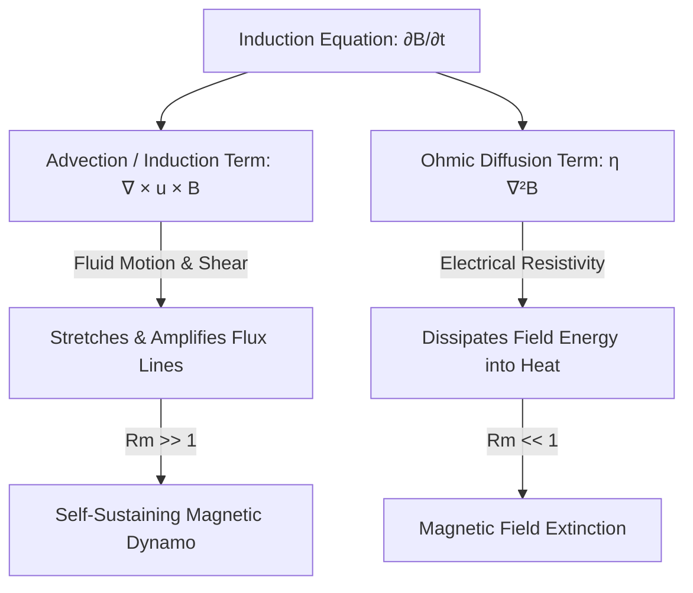
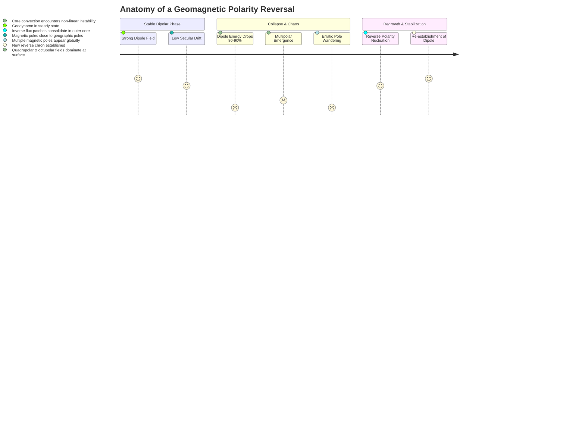

# The Dynamo Effect: How Celestial Engines Generate Magnetic Shields and Shape Planetary Habitability

**Date:** August 02, 2026

For billions of years, life on Earth has flourished under an invisible, dynamic shield: the geomagnetic field. Extending tens of thousands of kilometers into the vacuum of space, this magnetosphere deflects the ionizing solar wind, shields the biosphere from lethal galactic cosmic radiation, and prevents the stellar stripping of our atmospheric inventory and liquid water.

Yet the origin of this planetary shield presents a fundamental classical physics paradox: according to Maxwell's equations and Ohm's law, electric currents flowing through a metallic conductor like Earth's iron-nickel core must naturally dissipate due to electrical resistance. Calculations show that without an active replenishment mechanism, Earth's magnetic field would completely decay in fewer than **100,000 years** (a mere blink in geological time). 

The paleomagnetic record, however, reveals that Earth has possessed an active, robust magnetic field for at least **3.5 to 4.2 billion years**.

The solution to this paradox is the **Dynamo Effect** (or *Dynamo Theory*): a self-sustaining magnetohydrodynamic (MHD) process wherein the kinetic energy of a convective, rotating, electrically conducting fluid is continuously transformed into magnetic energy via electromagnetic induction. 

```
                                  +-------------------------------------------------------+
                                  |                 Planetary Cooling                     |
                                  |    (Radioactive Decay + Inner Core Solidification)    |
                                  +-------------------------------------------------------+
                                                              |
                                                              v
+-----------------------------+                   +-----------------------+
|      Coriolis Forces        |                   |  Thermal & Chemical   |
| (Rapid Planetary Rotation)  |                   |  Buoyancy Convection  |
+-----------------------------+                   +-----------------------+
               |                                              |
               |         Helical / Cyclonic Fluid Motion      |
               +--------------------->+<----------------------+
                                      |
                                      v
                      +-------------------------------+
                      |   Induction & Field Shearing  |
                      |   (Kinetic -> Magnetic Energy)|
                      +-------------------------------+
                                      |
                                      v
                      +-------------------------------+
                      |   Self-Sustaining Geodynamo   |
                      |   (Dipolar Magnetosphere)     |
                      +-------------------------------+
```

---

## 1. The Core Physics: Magnetohydrodynamics (MHD) & Induction

The dynamo effect operates at the intersection of fluid dynamics and Maxwellian electrodynamics, governed by the laws of **Magnetohydrodynamics (MHD)**.

### The Magnetic Induction Equation
The fundamental mathematical evolution of a magnetic field $\mathbf{B}$ within a moving fluid of velocity $\mathbf{u}$ and electrical conductivity $\sigma$ is dictated by the **magnetic induction equation**, derived by combining Faraday's law of induction, Ampère's law (neglecting displacement current in low-frequency non-relativistic fluid regimes), and Ohm's law for moving conductors ($\mathbf{J} = \sigma(\mathbf{E} + \mathbf{u} \times \mathbf{B})$):

$$\frac{\partial \mathbf{B}}{\partial t} = \nabla \times (\mathbf{u} \times \mathbf{B}) + \eta \nabla^2 \mathbf{B}$$

Where:
* $\mathbf{B}$ is the magnetic flux density vector.
* $\mathbf{u}$ is the fluid velocity vector field.
* $\eta = \frac{1}{\mu_0 \sigma}$ is the **magnetic diffusivity** (with $\mu_0$ being magnetic permeability and $\sigma$ electrical conductivity).
* $\nabla \times (\mathbf{u} \times \mathbf{B})$ is the **advection (stretching/twisting) term**, representing the generation and amplification of magnetic fields through fluid deformation.
* $\eta \nabla^2 \mathbf{B}$ is the **Ohmic diffusion (dissipation) term**, representing the resistive decay and smoothing of the field into heat.



### The Magnetic Reynolds Number ($Rm$)
Whether a celestial body can operate a dynamo depends on the dimensionless **Magnetic Reynolds Number ($Rm$)**, which quantifies the ratio of magnetic advection to magnetic diffusion over a characteristic length scale $L$ and flow velocity $U$:

$$Rm = \frac{U L}{\eta} = \mu_0 \sigma U L$$

| Regime | Physical Behavior | Celestial Outcome |
| :--- | :--- | :--- |
| **$Rm \ll 1$** (Diffusion Dominates) | Field lines diffuse rapidly through the fluid; resistive dissipation destroys magnetic structures faster than motion can replenish them. | **No Dynamo**. Field rapidly decays (e.g., small planetary moons, laboratory molten metals without forced fast flows). |
| **$Rm \sim 1$** (Critical Transition) | Marginal balance; weak transient fields may form but fail to self-sustain against perturbations. | **Subcritical Dynamo Threshold**. |
| **$Rm \gg 1$** ($Rm \sim 10^2 - 10^3$) | Fluid advection dominates diffusion; Alfvén's **Frozen-in Flux Theorem** holds. Magnetic lines of force move, stretch, and bend as if physically embedded in the fluid. | **Active Self-Sustaining Dynamo** (e.g., Earth's outer core: $Rm \approx 300 - 1000$; Solar convective zone: $Rm \approx 10^6 - 10^8$). |

### The Navier-Stokes & Lorentz Feedback Loop
A dynamo is not a kinematic one-way process. As the fluid amplifies the magnetic field, the induced electric currents $\mathbf{J} = \frac{1}{\mu_0}(\nabla \times \mathbf{B})$ produce a counteracting **Lorentz force** $\mathbf{J} \times \mathbf{B}$ on the fluid:

$$\rho \left( \frac{\partial \mathbf{u}}{\partial t} + (\mathbf{u} \cdot \nabla)\mathbf{u} \right) = -\nabla p + \rho \mathbf{g} - 2\rho(\mathbf{\Omega} \times \mathbf{u}) + \underbrace{\frac{1}{\mu_0}(\nabla \times \mathbf{B}) \times \mathbf{B}}_{\text{Lorentz Force}} + \mu \nabla^2 \mathbf{u}$$

This non-linear Lorentz force acts as a natural brake (**Lenz's Law saturation**). It halts exponential field growth and locks the geodynamo into **magnetostrophic equilibrium**, where the dominant dynamical balance in Earth's outer core occurs between the **Coriolis force** ($2\rho\mathbf{\Omega} \times \mathbf{u}$) and the **Lorentz force** ($\mathbf{J} \times \mathbf{B}$).

---

## 2. The Essential Ingredients for a Planetary Dynamo

For any astronomical body (rocky planet, gas giant, star, or moon) to ignite and sustain an active dynamo, three non-negotiable physical conditions must be met simultaneously:

```
                      +-----------------------------------------+
                      |   1. Electrically Conducting Fluid      |
                      |   (Liquid Fe-Ni, Metallic H, Plasma)    |
                      +-----------------------------------------+
                                           |
                                           v
       +-----------------------------------+-----------------------------------+
       |                                                                       |
       v                                                                       v
+-------------------------------+                               +-------------------------------+
|  2. Convective Energy Source  |                               | 3. Helicity / Coriolis Force  |
|  (Thermal + Compositional)    |                               | (Sufficient Planetary Spin)   |
+-------------------------------+                               +-------------------------------+
       |                                                                       |
       +-----------------------------------+-----------------------------------+
                                           |
                                           v
                      +-----------------------------------------+
                      |       ACTIVE SELF-SUSTAINING DYNAMO     |
                      +-----------------------------------------+
```

### 1. An Abundant Electrically Conducting Fluid Layer
The planet must possess a vast, mobile reservoir of electrically conducting fluid:
* **Terrestrial Planets (Earth, Mercury):** Liquid iron-nickel alloy outer core.
* **Gas Giants (Jupiter, Saturn):** Supercritical liquid metallic hydrogen (formed at pressures exceeding $1.4\text{ to }2.0\text{ Mbar}$).
* **Ice Giants (Uranus, Neptune):** High-pressure, supercritical ionic/superionic fluid "slush" consisting of water ($\text{H}_2\text{O}$), ammonia ($\text{NH}_3$), and methane ($\text{CH}_4$).
* **Stars (The Sun):** Fully ionized hydrogen-helium plasma.

### 2. A Vigorous Convective Energy Source
Fluid motion must be driven continuously over geological eons. In Earth's outer core, convection is sustained by two coupled mechanisms:
* **Thermal Convection:** Secular cooling of the planet since accretion, supplemented by the radioactive decay of long-lived unstable isotopes ($^{40}\text{K}$, $^{232}\text{Th}$, $^{238}\text{U}$) inside the core and mantle. The heat flux escaping into the lower mantle across the **Core-Mantle Boundary (CMB)** must exceed the conductive adiabatic gradient ($\sim 5 - 15\text{ TW}$).
* **Compositional (Chemical) Convection:** As the planet cools, pure iron-nickel crystallizes at the center to grow the solid inner core (growing at $\sim 0.5 - 1.0\text{ mm/year}$). This freezing process expels lighter impurities (silicon, sulfur, oxygen, carbon, and hydrogen) into the remaining liquid at the **Inner Core Boundary (ICB)**. Because this light-element-enriched fluid is less dense, it vigorously floats upward through the outer core, supplying over **70% of the modern geodynamo's convective power**.

### 3. Rotational Organization (The Coriolis Effect)
Random, isotropic thermal turbulence cannot generate a coherent, large-scale dipole field. Rapid planetary rotation introduces strong **Coriolis forces** (low Rossby number $Ro = \frac{U}{2\Omega L} \ll 1$), which aligns turbulent convective plumes into vertical, spiraling **helical Taylor columns** parallel to the planetary rotational axis (Taylor-Proudman theorem).

---

## 3. The Dynamo Mechanism: The $\alpha$ and $\Omega$ Effects

How does chaotic liquid iron convert mechanical swirling into a stable north-south dipolar field? The process is best understood through the classical two-step **Parker-Elsasser-Braginsky cycle**:

```
            [Poloidal Field] (North-South Dipole)
                    |
                    |  (1) Differential Rotation (Ω-Effect)
                    v  Shears and stretches field lines along equator
            [Toroidal Field] (East-West Rings inside Core)
                    |
                    |  (2) Helical Convection (α-Effect)
                    v  Coriolis twisting lifts and tilts loops back into meridional plane
            [Poloidal Field] (Regenerated and Amplified)
```

```
+---------------------------------------------------------------------------------------------------------+
|                                    THE αΩ DYNAMO CONVERSION CYCLE                                       |
+---------------------------------------------------------------------------------------------------------+
|                                                                                                         |
|     1. POLOIDAL FIELD (B_p)            2. THE Ω-EFFECT (Shearing)          3. THE α-EFFECT (Twisting)   |
|        Initial Dipole Lines               Core Differential Velocity          Upwelling Plumes + Spin   |
|                                                                                                         |
|              North                              North                               North               |
|               / \                                / \                                 / \                |
|              |   |                              |===| ===> [Toroidal]               | O | [Twisted Loop]|
|             /     \                            /     \                             /     \              |
|            |       |                          |=======|                           |       |             |
|             \     /                            \     /                             \     /              |
|              |   |                              |===|                               | O |               |
|               \ /                                \ /                                 \ /                |
|              South                              South                               South               |
|                                                                                                         |
|  * North-South oriented field.      * Faster equatorial core rotation   * Upward buoyant plumes rise;   |
|  * Extends outside into space.        drags poloidal lines eastward,      Coriolis force twists plumes, |
|                                       wrapping them into dense rings.     regenerating poloidal loops.  |
+---------------------------------------------------------------------------------------------------------+
```

### The $\Omega$-Effect (Toroidal Generation)
Differential rotation within the conducting fluid shears the existing north-south (poloidal) field lines. As inner layers of the liquid core rotate at slightly different angular velocities than outer layers, magnetic lines of force are stretched and wound azimuthally around the core's axis of rotation like rubber bands. This transforms poloidal magnetic energy into a powerful, internal **toroidal field** ($B_\phi$) that remains trapped deep inside the core.

### The $\alpha$-Effect (Poloidal Regeneration)
If the process stopped with the $\Omega$-effect, the field would degenerate into closed toroidal loops with zero external dipole. 

However, hot buoyant plumes of molten iron rise from the inner core boundary. As these plumes ascend, the **Coriolis force twists them** (clockwise in the Northern Hemisphere, counter-clockwise in the Southern Hemisphere). This helical, corkscrew motion lifts and twists the horizontal toroidal field lines into vertical, meridional loops. 

Turbulent diffusion merges these individual micro-loops into a coherent, large-scale, regenerated **poloidal field** ($B_p$), closing the feedback loop and ensuring steady-state amplification.

### Dynamo Classifications
* **$\alpha\Omega$ Dynamos:** Where strong differential shear dominates the toroidal generation and helical convection provides the poloidal regeneration (typical in the **Solar Dynamo** and stellar convective zones).
* **$\alpha^2$ Dynamos:** Where helical cyclonic turbulence ($\alpha$-effect) generates *both* the toroidal and poloidal fields, operating in bodies with relatively uniform rotation profiles.
* **$\alpha^2\Omega$ Dynamos:** The hybrid regime believed to govern **Earth's Geodynamo**, where differential rotation and helical convective columns operate in tandem.

---

## 4. Cowling's Anti-Dynamo Theorem: Why Geometry Matters

In 1933, British astrophysicist Thomas Cowling proved a foundational mathematical theorem that puzzled physicists for decades:

> **Cowling's Anti-Dynamo Theorem:**  
> *A steady, strictly axisymmetric magnetic field cannot be maintained by axisymmetric fluid motion.*

```
+-----------------------------------------------------------------------------+
|                      COWLING'S ANTI-DYNAMO THEOREM                          |
+-----------------------------------------------------------------------------+
| If a magnetic field B has pure rotational symmetry (∂/∂φ = 0), there must   |
| exist a closed "neutral line" in the meridional plane where B_meridional = 0|
| By Ampère's and Ohm's laws, sustaining current at this neutral line requires|
| non-zero curl of u × B, which vanishes in purely 2D axisymmetric flows.     |
|                                                                             |
| CONCLUSION: Magnetic dynamos are ESSENTIALLY THREE-DIMENSIONAL and require  |
| non-axisymmetric, turbulent, helical vorticity to prevent total decay.      |
+-----------------------------------------------------------------------------+
```

Because of Cowling's theorem, simple 2D laminar flows can never generate a dynamo. Planetary dynamos are intrinsically **chaotic, three-dimensional, turbulent engines** that rely on longitudinal asymmetry and helical fluid helicity to continuously circumvent resistive extinction.

---

## 5. Planetary Magnetism: A Comparative Solar System Analysis

Why does Earth maintain a powerful magnetic shield while our cosmic neighbors exhibit vastly different magnetic profiles? The table below provides a comparative analysis of dynamos across the solar system:

| Celestial Body | Core / Convective Medium | Dynamo Status | Surface Field Strength | Structural Features & Dynamic Mechanisms |
| :--- | :--- | :--- | :--- | :--- |
| **Earth** | Liquid Fe-Ni outer core ($r \approx 3480\text{ km}$) + solid inner core | **Active** ($\alpha^2\Omega$) | $\sim 30 - 65\text{ }\mu\text{T}$ | Stable dipole tilted $\approx 11^\circ$; compositional buoyancy driven by inner core crystallization; periodic polarity reversals. |
| **Mars** | Molten Fe-Ni-S core ($r \approx 1830\text{ km}$) | **Extinct** (Died $\sim 4.0\text{ Ga}$) | $\sim 0\text{ }\mu\text{T}$ (Global)<br>$\le 1.5\text{ }\mu\text{T}$ (Crustal) | Small core cooled rapidly; stagnant lid mantle shut down convective heat extraction; strong remanent magnetization locked in ancient southern highland rocks. |
| **Venus** | Molten Fe-Ni core ($r \approx 3110\text{ km}$) | **Inactive / Absent** | $< 10^{-5}\times\text{ Earth}$ | Similar size/composition to Earth, but lack of plate tectonics prevents mantle cooling; core heat flux is sub-adiabatic; no inner core crystallization. |
| **Mercury** | Molten Fe-Ni outer core over large solid core | **Active** (Weak) | $\sim 0.3\text{ }\mu\text{T}$ ($\sim 1\%\text{ Earth}$) | Extremely large metallic core ($r \approx 2000\text{ km}$); driven by "iron snow" precipitation or double-diffusive compositional convection; dipole offset 20% north. |
| **Jupiter** | Metallic hydrogen layer ($r \approx 55,000\text{ km}$) | **Active** (Super-Dynamo) | $\sim 420 - 1400\text{ }\mu\text{T}$ ($\sim 20\times\text{ Earth}$) | Vast, highly conductive fluid layer under 4+ Mbar pressure; rapid 9.9-hour rotation produces colossal Coriolis forces; massive magnetosphere extending past Saturn. |
| **Saturn** | Metallic hydrogen layer ($r \approx 30,000\text{ km}$) | **Active** (Axisymmetric) | $\sim 21\text{ }\mu\text{T}$ | Uniquely aligned magnetic and rotational axes ($< 0.01^\circ$ tilt); differential rotation in an outer helium-rain layer filters and axisymmetrizes the field. |
| **Uranus & Neptune** | Ionic water-ammonia-methane mantle slush | **Active** (Multipolar / Tilted) | $\sim 10 - 100\text{ }\mu\text{T}$ | Non-dipolar, highly disordered quadrupolar/octupolar fields; magnetic axes tilted $59^\circ$ (Uranus) and $47^\circ$ (Neptune); dynamo generated in thin outer fluid shell. |
| **The Sun** | Ionized Hydrogen-Helium Plasma convective envelope | **Active** (Cyclic $\alpha\Omega$) | $\sim 100 - 500\text{ }\mu\text{T}$ (Global)<br>$\le 0.4\text{ T}$ (Sunspots) | Periodic 11-year sunspot cycle / 22-year magnetic polarity reversal; shear localized at the **tachocline** layer between radiative and convective zones. |

```
+----------------------------------------------------------------------------------------------------+
|                                    SOLAR SYSTEM DYNAMO ARCHITECTURES                               |
+----------------------------------------------------------------------------------------------------+
|                                                                                                    |
|    EARTH: Deep Core Dynamo             JUPITER: Metallic Hydrogen         URANUS: Thin Shell Dynamo|
|                                                                                                    |
|         .----------------.                 .----------------.                 .----------------.   |
|        /    Mantle        \               /  Molecular H2    \               /   Rock/Ice Core  \  |
|       /   .------------.   \             /   .------------.   \             /   .------------.   \ |
|      |   / Liquid Outer \   |           |   / Metallic H   \   |           |   /  Thin Ionic  \   ||
|      |  |  [Fe-Ni Core]  |  |           |  | [Active Dynamo]|  |           |  |  [Water Mantle]|  ||
|      |  |   .--------.   |  |           |  |   .--------.   |  |           |  |   .--------.   |  ||
|      |  |  |Solid Core|  |  |           |  |  |Heavy Core|  |  |           |  |  | Solid Core |  |  ||
|      |  |   '--------'   |  |           |  |   '--------'   |  |           |  |   '--------'   |  ||
|      |   \   Dynamo     /   |           |   \              /   |           |   \   Dynamo     /   ||
|       \   '------------'   /             \   '------------'   /             \   '------------'   / |
|        \                  /               \                  /               \                  /  |
|         '----------------'                 '----------------'                 '----------------'   |
|         Dipolar, Stable                     Ultra-Powerful Dipole             Asymmetric Quadrupole|
+----------------------------------------------------------------------------------------------------+
```

---

## 6. Geomagnetic Reversals and Secular Variations

One of the most remarkable features of Earth's geodynamo is that its polarity is not permanent: it spontaneously fluctuates and periodically inverts.

### Paleomagnetism and the Polarity Record
When magma cools below the **Curie temperature** ($\approx 580^\circ\text{C}$ for magnetite), magnetic minerals lock in the orientation and intensity of Earth's magnetic field at that exact moment (**thermoremanent magnetization**). 

The alternating magnetic striping observed across the ocean floor along mid-ocean ridges (the Vine-Matthews-Morley hypothesis) provides an empirical record of hundreds of geomagnetic reversals over geological time:
* **Current Chron:** The *Brunhes-Matuyama* chron, which flipped to our current "normal" polarity approximately **780,000 years ago**.
* **Reversal Frequency:** Highly stochastic, ranging from an average of 3 to 5 flips per million years, interspersed with "Superchrons" (e.g., the Cretaceous Normal Superchron lasting nearly 40 million years without a single flip).



### The Mechanism of a Reversal
Numerical 3D MHD simulations (such as the landmark **Glatzmaier-Roberts model** in 1995) showed that reversals occur spontaneously without any external astronomical triggers:
1. Convective fluctuations in the outer core create local "patches" of reversed magnetic flux at the core-mantle boundary (such as today's **South Atlantic Anomaly**).
2. If turbulent flow advects and amplifies these reverse patches, the overall dipolar field strength collapses by **80% to 90%**.
3. During the transition (which lasts between **1,000 and 10,000 years**), the simple dipole disappears, replaced by complex, chaotic **quadrupolar and octupolar components** with multiple magnetic poles scattered across low latitudes.
4. The field gradually rebuilds its dipole geometry, with polarity reversed.

---

## 7. Laboratory Dynamos: Recreating Planetary Cores on Earth

Validating nonlinear MHD dynamo theory required reproducing self-sustaining magnetic generation in controlled physical laboratories. Because liquid sodium has high electrical conductivity ($\sigma$) and low density, several pioneering liquid sodium experiments achieved the critical magnetic Reynolds number ($Rm > Rm_{\text{crit}}$) around the turn of the millennium:

```
+--------------------------------------------------------------------------------------------------------+
|                                    LANDMARK LABORATORY EXPERIMENTS                                     |
+--------------------------------------------------------------------------------------------------------+
| 1. The Riga Dynamo (Latvia, 1999)                                                                      |
|    * Flow: Helical Ponomarenko flow driven by propellers inside concentric stainless steel cylinders.   |
|    * Achievement: First experimental proof of self-excitation of an electromagnetic field in fluid Na. |
|                                                                                                        |
| 2. The Karlsruhe Dynamo (Germany, 1999)                                                                |
|    * Flow: Array of 52 periodic helical spin pipes based on the G.O. Roberts kinematic dynamo model.    |
|    * Achievement: Confirmed that organized spatial helicity lowers the critical Reynolds threshold.    |
|                                                                                                        |
| 3. The VKS Experiment (Cadarache, France, 2006)                                                        |
|    * Flow: Turbulent von Kármán swirling flow between counter-rotating impellers in liquid sodium.     |
|    * Achievement: First laboratory observation of SPONTANEOUS MAGNETIC FIELD REVERSALS and excursions  |
|      analogous to Earth's paleomagnetic behavior.                                                      |
+--------------------------------------------------------------------------------------------------------+
```

---

## 8. Environmental, Biospheric, and Technological Significance

The geodynamo is not an abstract astrophysical phenomenon; it is the fundamental environmental engine that makes Earth a habitable oasis rather than an irradiated, arid wasteland like Mars.

```
                     SOLAR WIND & CORONAL MASS EJECTIONS (CMEs)
                         =====================================>
                                          \
                                           \  [Bow Shock]
                                            \  
                                             +--------------------+
                                             |   MAGNETOSPHERE    |
                                             |  (Dynamo Shield)   |
                                             +--------------------+
                                            /           |
                                           /            v
                                          /   [Trapped Radiation Belts]
                         ====================>[ Van Allen Belts ]=====>
                                                        |
                                                        v
                                              +-------------------+
                                              | Earth's Biosphere |
                                              | & Atmosphere Safe |
                                              +-------------------+
```

### 1. Atmospheric Retention & Water Preservation
Without a strong magnetic dipole, the supersonic, magnetized plasma stream from the solar wind interacts directly with the upper planetary ionosphere. Solar wind magnetic field lines induce electric fields that ionize and accelerate atmospheric atoms, stripping them away via **ion pick-up, charge exchange, and sputtering**:
* **Mars' Fate:** When the Martian dynamo died $\sim 4.0\text{ Ga}$, solar wind stripping depleted its dense $\text{CO}_2$ atmosphere over several hundred million years, reducing surface pressure from $>1\text{ bar}$ to a tenuous $6\text{ mbar}$ and desiccating its surface rivers and oceans.
* **Earth's Preservation:** The geodynamo stands off the solar wind at a standoff distance of **10 to 12 Earth radii** ($R_E$), preventing atmospheric sputtering and preserving our hydrosphere.

### 2. Biosphere Shielding from High-Energy Particles
The magnetosphere diverts high-energy **Galactic Cosmic Rays (GCRs)** and **Solar Particle Events (SPEs)** along magnetic field lines toward the uninhabited polar cusps, creating harmless auroral displays (*Aurora Borealis / Australis*) in the thermosphere while sparing surface biological DNA from lethal ionizing radiation dosages and preventing catastrophic depletion of the stratospheric ozone layer.

### 3. Space Weather Vulnerabilities in the Modern Technological Era
While the geodynamo shields the biosphere, dynamic fluctuations in the magnetosphere during **Coronal Mass Ejections (CMEs)** pose acute risks to human spaceflight and technological infrastructure:

```
+-----------------------------------------------------------------------------------------+
|                              SPACE WEATHER THREAT TAXONOMY                              |
+-----------------------------------------------------------------------------------------+
| Geomagnetically Induced Currents (GIC)                                                  |
| * Fluctuating geomagnetic fields induce low-frequency E-fields in Earth's crust.        |
| * Saturated high-voltage power transformers lead to cascading grid blackouts            |
|   (e.g., 1859 Carrington Event, 1989 Hydro-Québec collapse).                            |
|                                                                                         |
| Satellite Orbit Decay & Electronics Degradation                                         |
| * Auroral heating causes upper thermospheric expansion, increasing orbital drag on      |
|   Low Earth Orbit (LEO) satellite constellations (e.g., Starlink loss in 2022).         |
| * Single Event Upsets (SEUs) and deep dielectric charging in satellite microchips.      |
|                                                                                         |
| GNSS & Radio Communications Blackouts                                                   |
| * Ionospheric scintillation severely degrades GPS/Galileo positioning accuracy and      |
|   causes High-Frequency (HF) radio propagation blackouts across polar flight routes.   |
+-----------------------------------------------------------------------------------------+
```

---

## 9. Future Outlook: The Deep Evolution of the Geodynamo

Will Earth's magnetic engine ever shut down? 

Thermodynamic calculations of core energetics indicate that the geodynamo is exceptionally stable. Because compositional convection driven by the continuing crystallization of the solid inner core is remarkably efficient, the geodynamo will continue generating a protective magnetic field for at least another **1.5 to 2.5 billion years**.

Eventually, as Earth's interior cools, the solid inner core will grow to encompass the entire core volume. Once the liquid outer core freezes solid, convective fluid motion will cease, the geodynamo will switch off, and Earth will join Mars as a magnetically quiet planetary relic. Until that distant epoch, however, the churning liquid iron 3,000 kilometers beneath our feet will remain our silent, indispensable environmental guardian.

---

## Summary & Key Takeaways

1. **The Dynamo Effect** converts fluid kinetic energy (convection and rotation) into persistent magnetic energy via electromagnetic induction, overcoming resistive Ohmic decay.
2. **Three Core Prerequisites:** An electrically conducting fluid layer (liquid Fe-Ni), an active thermal/compositional buoyancy source, and Coriolis force organization.
3. **The $\alpha\Omega$ Interaction:** Differential rotation wraps poloidal lines into toroidal rings ($\Omega$-effect), while Coriolis-twisted convective plumes twist toroidal lines back into poloidal loops ($\alpha$-effect).
4. **Cowling's Theorem:** Mandates that a working dynamo must be fully 3-dimensional and non-axisymmetric.
5. **Planetary Divergence:** Earth's active plate tectonics and inner core crystallization sustain its geodynamo; Mars lost its dynamo due to rapid core cooling, while Venus lacks the necessary core heat flux.
6. **Planetary Habitability:** The resulting magnetosphere shields Earth's biosphere from cosmic rays and protects our atmosphere and oceans from solar wind erosion.
