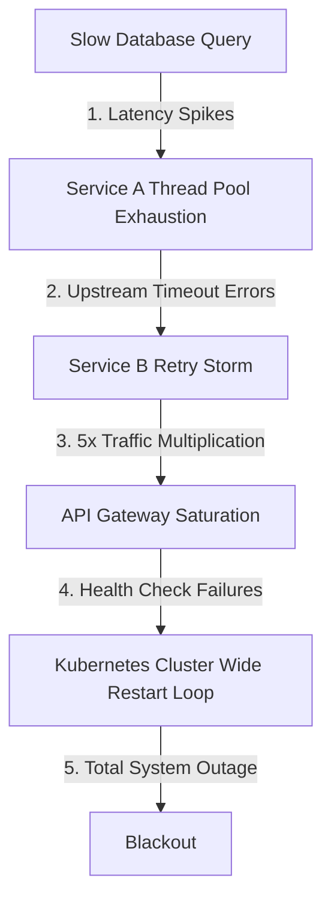
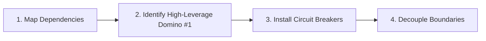

# The Domino Effect: From Physical Mechanics to Systems Architecture and Human Behavior

**Date:** August 02, 2026

In 1983, physicist Lorne Whitehead published a striking paper in the *American Journal of Physics* demonstrating a simple yet counter-intuitive law of physical mechanics: a single standing domino is capable of toppling another domino **1.5 times larger** than itself. 

When arranged in a geometric progression where each successive domino increases in height and mass by 50%, a breathtaking exponential chain reaction unfolds:
* **Domino 1:** A tiny, fragile sliver just 5 mm tall and 1 mm thick.
* **Domino 18:** Stands tall enough to topple the Leaning Tower of Pisa.
* **Domino 23:** Towers over the Eiffel Tower.
* **Domino 29:** Easily knocks over a monolith the size of the Empire State Building.
* **Domino 31:** Surpasses Mount Everest.

```
+-------------------------------------------------------------------------------------------------------+
|                                  THE GEOMETRIC DOMINO MAGNIFICATION                                   |
+-------------------------------------------------------------------------------------------------------+
|                                                                                                       |
|                                                                                         [Domino 29]   |
|                                                                                         (Empire State)|
|                                                                                            |===|      |
|                                                                                            |===|      |
|                                                                          [Domino 23]       |===|      |
|                                                                          (Eiffel Tower)    |===|      |
|                                                                               |===|        |===|      |
|                                                         [Domino 18]           |===|        |===|      |
|                                                         (Pisa Tower)          |===|        |===|      |
|                                      [Domino 10]            |===|             |===|        |===|      |
|                                      (~1 Meter)             |===|             |===|        |===|      |
|                                         |===|               |===|             |===|        |===|      |
|            [Domino 1]                   |===|               |===|             |===|        |===|      |
|              (5 mm)                     |===|               |===|             |===|        |===|      |
|               | |                       |===|               |===|             |===|        |===|      |
|  Initial: 0.024 micro-Joules  =====================================================================> |
|  Final Energy Released: ~51 Giga-Joules (Over 2-Billion-Fold Geometric Amplification)                 |
+-------------------------------------------------------------------------------------------------------+
```

The initial input energy required to tip the first 5 mm domino is approximately **0.024 micro-joules**—barely a fraction of a light finger tap. Yet by the 29th domino, the kinetic energy released exceeds **51 gigajoules** (roughly 12 tons of TNT equivalent). 

How does a microscopic nudge produce a skyscraper-crushing cataclysm? The answer lies at the heart of the **Domino Effect**: the realization that dominoes do not *create* energy; they **release latent gravitational potential energy** stored in metastable equilibrium.

The domino effect is far more than an engaging physics demonstration. It serves as one of the most powerful universal mental models in systems engineering, distributed architecture, behavioral psychology, and organizational design.

---

## 1. The Anatomy of a Cascade: Three Universal Preconditions

Every domino cascade—whether in a physics lab, a global cloud outage, or an individual's morning routine—requires three fundamental elements:

```
+---------------------------------------------------------------------------------------+
|                               THE THREE DOMINO PILLARS                                |
+---------------------------------------------------------------------------------------+
|                                                                                       |
|   1. METASTABLE EQUILIBRIUM          2. TIGHT COUPLING              3. CRITICAL       |
|      (Stored Latent Energy)             (Proximity & Dependency)       PERTURBATION   |
|                                                                                       |
|             |---|                            |---|  |---|                \            |
|             |   |                            |   |  |   |                 \ [Push]    |
|             |   |                            |   |  |   |                  v          |
|            /     \                          /     \/     \               |---|        |
|           =========                        ===============               |   |        |
|                                                                          |   |        |
|  * High center of mass.             * Output of Element A         * Microscopic event |
|  * Stored tension or stress.          directly strikes Element B.   crosses stability |
|  * Awaiting release.                * No blast walls or gaps.       threshold.        |
+---------------------------------------------------------------------------------------+
```

### 1. Metastable Equilibrium (Latent Energy)
A standing domino is in a state of precarious, metastable balance. Its center of mass is elevated above the ground, storing gravitational potential energy ($U = mgh$). It requires only a minute lateral displacement of its center of mass beyond its base pivot point to convert that potential energy into kinetic energy. 

In complex systems, latent energy manifests as **systemic tension**: unapplied software patches, exhausted buffer pools, overloaded database indexes, hidden technical debt, or emotional burnout.

### 2. Tight Coupling (Dependency Proximity)
For a cascade to occur, dominoes must be placed close enough that the falling arc of one object collides forcefully with the next. If the distance between two dominoes exceeds their falling radius, the chain reaction terminates immediately. 

In architecture and organizations, tight coupling occurs when service $B$ cannot function without synchronous, low-latency responses from service $A$, or when a project cannot advance without a single individual's manual approval.

### 3. Critical Perturbation (The Trigger)
The trigger is often deceptively trivial: a single misplaced config flag, an unhandled null pointer, a minor network hiccup, or a 15-minute sleep delay. While human intuition instinctively blames the trigger for the resulting catastrophe, the trigger is merely the **catalyst** that unleashes the pre-existing latent energy stored across tightly coupled nodes.

---

## 2. The Domino Effect in Software & Distributed Systems

Nowhere is the domino effect more dangerous—or more prevalent—than in modern decoupled, microservice-based distributed systems. When systems are interconnected over network boundaries, a single degraded component can trigger an uncontained **cascading failure**.



### The Anatomy of a Distributed Cascading Failure

Consider a classic microservice topology:

```
[Client App] ---> [API Gateway] ---> [Order Service] ---> [Payment Service] ---> [Legacy Database]
```

1. **The Initial Topple (Downstream Degradation):** The `Legacy Database` experiences a temporary lock contention or disk I/O bottleneck, increasing query response time from 10 ms to 3,000 ms.
2. **The First Collision (Thread Starvation):** The `Payment Service` holds open HTTP worker threads waiting for database responses. Within seconds, its internal thread pool and connection pool are completely exhausted. Incoming payment requests back up in unbounded memory queues.
3. **The Amplification Wave (Retry Storms & Thundering Herds):** The upstream `Order Service` experiences client timeouts. By default, its HTTP client immediately fires 3 automatic retries per failed request. Instead of 1,000 requests per second, the `Payment Service` is suddenly bombarded with **4,000 requests per second**.
4. **The Structural Collapse (Health Check Death Spiral):** Overloaded with retries, the `Payment Service` instances stop responding to Kubernetes `/healthz` liveness probes. Kubernetes declares the pods unhealthy and abruptly kills them, routing 100% of remaining traffic to the few surviving pods, which instantly crash under the load.
5. **Total Outage:** The API Gateway runs out of sockets, and the entire platform collapses globally.

### Architectural Domino Breakers: Designing for Resilience

To prevent catastrophic cascades in distributed infrastructure, engineers employ specific architectural patterns designed to act as **firewalls and blast breaks**:

```
+----------------------------------------------------------------------------------------------------+
|                                    DISTRIBUTED DOMINO BREAKERS                                     |
+----------------------------------------------------------------------------------------------------+
|                                                                                                    |
|    1. CIRCUIT BREAKER PATTERN                 2. BULKHEADING              3. JITTERED BACKOFF      |
|                                                                                                    |
|         [Closed (Normal)]                        [Pool A]   [Pool B]          [Decorrelated Wait]  |
|                 |                                  |          |                     . . .          |
|       (Failure Threshold Met)                      |          |                    .   .           |
|                 v                                 ===        ===                  .     .          |
|          [Open (Tripped)]                       (Isolated) (Isolated)          -----------------   |
|                 |                              Failures in A cannot           Retries spread over  |
|         (Fast Fail / Fallback)                 consume resources of B.        randomized intervals.|
+----------------------------------------------------------------------------------------------------+
```

| Pattern | Mechanism | Domino Metaphor |
| :--- | :--- | :--- |
| **Circuit Breakers** (e.g., Resilience4j, Envoy) | Automatically trips to `OPEN` state after error threshold is crossed, instantly returning cached fallbacks or errors without hitting downstream dependencies. | **The Gap in the Row:** Physically removes the next domino so falling blocks hit empty air. |
| **Bulkheading** | Partitions thread pools, CPU quotas, memory, and database connection pools by tenant, service, or priority level. | **The Fire Wall:** Enclosing domino clusters in independent compartments so a collapse in Room A cannot touch Room B. |
| **Exponential Backoff with Full Jitter** | Progressively doubles retry wait times ($t = 2^n$) and introduces randomized jitter ($t_{\text{wait}} = \text{rand}(0, t)$) to prevent synchronization. | **Damping the Wave:** Prevents falling blocks from striking simultaneously as a synchronized battering ram. |
| **Adaptive Load Shedding** | Monitors CPU queue depth and drops low-priority or non-critical incoming traffic before system saturation occurs. | **Pruning the Row:** Sacrifices peripheral branches to keep the structural core standing. |

---

## 3. The Domino Effect in Behavioral Psychology & Habit Formation

The geometric energy amplification seen in physical dominoes is equally profound in human psychology and behavioral science. A single small action, executed consistently, triggers an avalanche of downstream decisions and cognitive shifts.

```
                                  +-----------------------+
                                  |    TINY TRIGGER       |
                                  | (Make Bed / 2m Walk)  |
                                  +-----------------------+
                                              |
                                              v
                                  +-----------------------+
                                  |  DOPAMINE & IDENTITY  |
                                  | ("I am an organized,  |
                                  |   disciplined person")|
                                  +-----------------------+
                                              |
                                              v
                                  +-----------------------+
                                  |  DOWNSTREAM MOMENTUM  |
                                  | (Clear Desk, No Sugar,|
                                  |   Deep Work Session)  |
                                  +-----------------------+
                                              |
                                              v
                                  +-----------------------+
                                  | EXPONENTIAL LIFE SHIFT|
                                  | (High Agency, Mastery)|
                                  +-----------------------+
```

### The Science of "Habit Stacking"
In behavioral frameworks popularized by Dr. BJ Fogg (*Tiny Habits*) and James Clear (*Atomic Habits*), the domino effect is harnessed through **Habit Stacking**: linking a desired new habit to an already established, frictionless anchor routine:

$$\text{After [CURRENT DOMINO], I will [NEW DOMINO]}$$

* *"After I brew my morning espresso (Anchor), I will write down my top 3 priorities on an index card (Domino 1)."*
* *"After I write my 3 priorities (Domino 1), I will open my code editor in full-screen distraction-free mode (Domino 2)."*
* *"After I enter full-screen mode (Domino 2), I will write code for 25 unbroken minutes (Domino 3)."*

### Why the Behavioral Domino Effect Works
1. **Minimizing Activation Energy:** The brain naturally conserves energy and resists drastic transitions. Overcoming the inertia to complete a 2-hour workout feels overwhelming; putting on running shoes (Domino 1) requires almost zero activation energy.
2. **Cognitive Momentum:** Once an initial action is taken, the brain experiences an immediate dopamine reward and shifts into an active state. Overcoming dynamic friction is significantly easier than overcoming static inertia.
3. **Identity Coherence:** Psychologists recognize that humans have an innate need for cognitive consistency. Taking one disciplined action signals to the subconscious: *"I am the type of person who is structured and intentional."* Subsequent decisions naturally align with that affirmed identity.

### The Dark Side: The Negative Behavioral Cascade
The domino effect operates with ruthless symmetry in the opposite direction. A single negative disruption often triggers a catastrophic behavioral cascade:

```
[Late Night Scrolling] ---> [Poor Sleep Architecture] ---> [Morning Grogginess & Brain Fog]
                                                                    |
[Missed Critical Deadlines] <--- [Procrastination & Guilt] <--- [Junk Food & Sugar Crash]
```

Recognizing negative dominoes early allows you to insert a **behavioral circuit breaker**—such as immediately stepping outside for a 10-minute walk or closing your laptop—before the third and fourth dominoes fall.

---

## 4. Second-Order Thinking & Blast Radius Reduction

In strategic leadership and system architecture, understanding the domino effect demands mastering **Second-Order Thinking**.

```
+-----------------------------------------------------------------------------------+
|                        FIRST-ORDER VS. SECOND-ORDER THINKING                      |
+-----------------------------------------------------------------------------------+
| First-Order Question:                                                             |
| "What is the immediate, direct benefit of tipping this domino?"                   |
| -> Simple, obvious, short-term (e.g., "Deleting this legacy cache saves $500/mo")|
|                                                                                   |
| Second-Order Question:                                                            |
| "And then what happens? What downstream dependencies are triggered?"             |
| -> Complex, systemic, long-term (e.g., "Traffic bypasses cache -> database locks  |
|    up -> checkout service fails -> $2M revenue lost in 3 hours")                 |
+-----------------------------------------------------------------------------------+
```

### Chesterton's Fence: Respecting Latent Couplings
The philosopher G.K. Chesterton famously proposed a parable: if you come across a fence erected in the middle of a road and see no obvious reason for it, the worst thing you can do is tear it down. You must first discover *why* it was built.

In engineering and organizational policy, legacy systems, peculiar code guards, and seemingly redundant processes are often **stabilizing shims** placed specifically to keep adjacent dominoes from falling. Removing them without comprehensive dependency tracing triggers unexpected systemic collapse.

### Charles Perrow’s Normal Accidents Theory
Sociologist Charles Perrow argued that in systems characterized by **Interactive Complexity** and **Tight Coupling**, multiple unexpected small failures will inevitably interact in unpredictable ways to produce catastrophic outcomes ("normal accidents"):

```
           High ^
                |   [Linear Complex]               [HIGH RISK CASYNES]
                |   - Dam construction              - Nuclear power plants
Interactive     |   - Assembly lines                - Global distributed microservices
Complexity      |                                   - High-frequency trading
                |
                |   [Linear Simple]                [Tightly Coupled Simple]
                |   - Simple manufacturing          - Rail networks
                |   - Batch processing              - Power grids
                +------------------------------------------------------------>
                Low               Coupling Strictness                    High
```

To make complex systems resilient against domino cascades, we must deliberately **loosen coupling**:
* Convert synchronous RPC calls into asynchronous event-driven message streams (Kafka, RabbitMQ, SQS).
* Implement idempotency and eventual consistency rather than strict distributed ACID transactions.
* Deconstruct monolithic organizational hierarchies into autonomous, cross-functional squads with decoupled deployment pipelines.

---

## 5. Strategic Framework: Harnessing and Containing the Domino Effect

Whether managing software infrastructure, leading organizations, or designing personal routines, apply the following 4-step framework:



### 1. Map Latent Energy and Hidden Couplings
* Conduct architecture and dependency audits to uncover single points of failure (SPOFs) and synchronous downstream dependencies.
* Identify hidden systemic stresses before they are exposed by an unexpected trigger.

### 2. Identify the High-Leverage "Lead Domino"
* In any complex problem or multi-faceted goal, locate the single action that makes all subsequent tasks easier or unnecessary (the Pareto "Lead Domino"). Focus 80% of your energy on tipping this single block.

### 3. Engineer Intentional Gaps (Circuit Breakers)
* Ensure that failures are contained locally. Build bulkheads into infrastructure, create cash reserves in corporate budgets, and set personal boundaries against work spillover.

### 4. Decouple Tightly Bound Interfaces
* Move from synchronous dependencies to asynchronous, fault-tolerant interactions across both technical systems and human workflows.

---

## Summary & Key Takeaways

1. **Exponential Amplification:** In physical mechanics, a tiny 5 mm domino can topple an Empire State Building-sized block in 29 steps through the geometric release of latent potential energy.
2. **The Three Preconditions:** Cascades require stored latent energy (metastable state), tight coupling (dependency proximity), and a critical perturbation (trigger).
3. **Resilience Engineering:** Distributed cascading failures can be prevented using circuit breakers, bulkheading, adaptive load shedding, and jittered exponential backoffs.
4. **Behavioral Stacking:** In human performance, small anchor habits trigger powerful cognitive momentum and self-affirming identity cascades.
5. **Decoupled Architecture:** Tightly coupled complex systems are inherently prone to uncontainable domino collapses; decoupling interfaces is the most effective defense against catastrophic failure.
